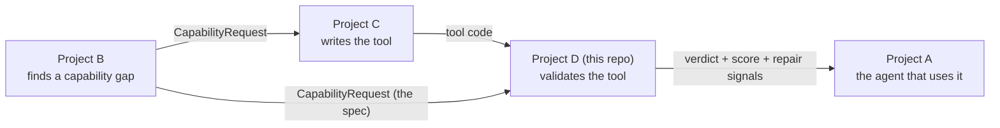
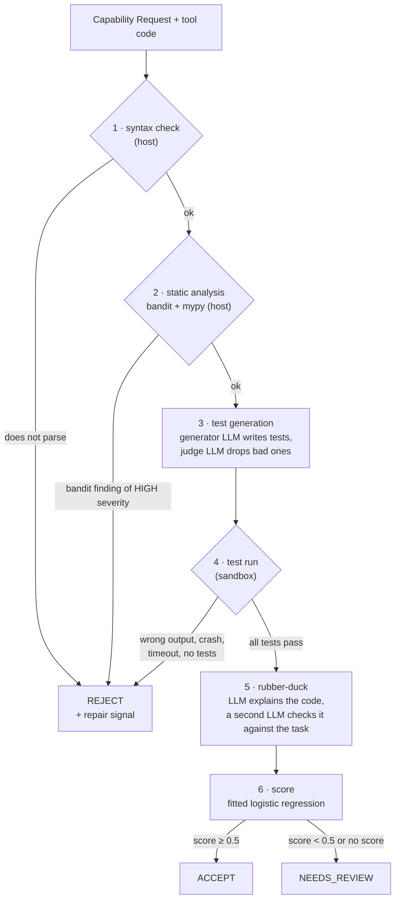
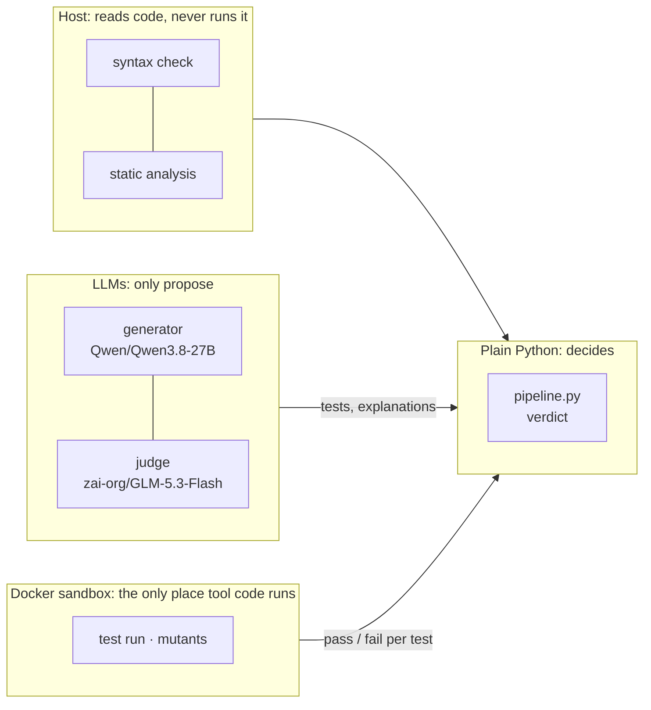
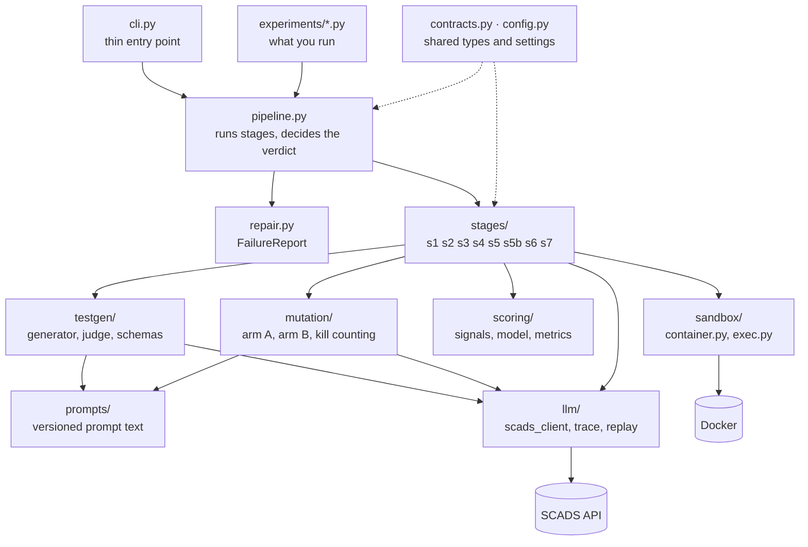
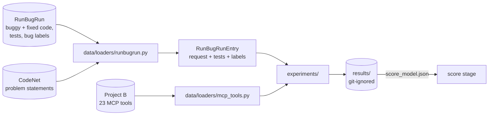

# toolvalidator — Project D

Validation of LLM-synthesized tools. Given a tool (Python code) and a **Capability Request**
(the task: name, description, typed inputs/outputs), decide **ACCEPT / REJECT / NEEDS_REVIEW**,
with a reliability score and structured repair signals. The tool goes through checks that
get more expensive step by step: syntax check and static analysis first, then tests run in
a sandbox, then LLM-based checks and a fitted score.

Research project (TU Dresden, Chair of Scalable Software Architectures for Data Analytics).
Evaluated on the RunBugRun dataset (Python subset). The deliverable is the experiments and
the report (`docs/reports/Project_D_Report.docx`).

## Quickstart

```bash
python -m venv .venv && source .venv/bin/activate     # Windows: .\.venv\Scripts\Activate.ps1
pip install -e ".[dev]"
docker build -t toolvalidator-sandbox:py3.12 toolvalidator/sandbox
cp .env.example .env          # SCADS_API_KEY, SCADS_GENERATOR_MODEL, SCADS_JUDGE_MODEL

# the local gate (run before every commit)
ruff format . && ruff check . && mypy --strict toolvalidator data experiments && pytest -q

# validate one tool (the CLI runs syntax check + static analysis only, see below)
python -m toolvalidator.cli validate --tool examples/celsius.py --request examples/celsius.json
```

The diagrams below are Mermaid; GitHub renders them. In VS Code, a Mermaid preview extension
is needed.

---

## 1. Where Project D sits



Project B notices that an agent is missing a capability and writes a Capability Request for
it. Project C writes a tool for that request. **Project D decides whether the tool is fit to
use** before Project A, the agent, calls it. The request is Project B's schema, used
unchanged (`docs/capability_request.md`).

---

## 2. How one tool is validated



The stages run in order, and **the first stage that fails ends the run with REJECT**. A
REJECT carries a `FailureReport` (stage, category, message, line) that tells Project C what
to fix.

| # | Stage | File | What it does | Can it reject? |
|---|---|---|---|---|
| 1 | syntax check | `stages/s1_parse.py` | `ast.parse` the source | yes |
| 2 | static analysis | `stages/s2_static.py` | **bandit** looks for dangerous calls (`os.system`, `eval`, `shell=True`); **mypy** looks for type errors | only a bandit finding of HIGH severity; mypy's error count is only a signal |
| 3 | test generation | `stages/s3_testgen.py`, `testgen/` | the generator model writes 8 tests from the request; the judge model, which never sees the code, removes tests it thinks are wrong | no |
| 4 | test run | `stages/s4_execute.py`, `harness.py`, `compare.py` | runs every test inside the Docker sandbox in one container call and compares the outputs | yes |
| 5 | rubber-duck | `stages/s5b_rubberduck.py` | LLM 1 explains the code without seeing the task; LLM 2 checks each requirement against that explanation without seeing the code | no |
| 6 | score | `stages/s6_score.py`, `scoring/` | turns the signals collected so far into P(correct) with the model fitted in RQ4 | no; a low score gives NEEDS_REVIEW |

**Example.** The task says "read two integers and print their sum". The tool prints `a - b`.

- Syntax check: fine.
- Static analysis: fine as well. The code is safe and correctly typed, so neither bandit nor
  mypy has anything to report. That is why static analysis alone catches no logic bugs (RQ2).
- Test generation: writes tests such as `2 3` → `5`.
- Test run: the tool prints `-1`. The run fails, so the verdict is **REJECT**, with a repair
  signal `test run / wrong_output` that says which test failed.

If a tool passes every generated test, the score still decides. A tool that the rubber-duck
check flags as violating a requirement gets a low score and goes to **NEEDS_REVIEW** instead
of ACCEPT.

**Outside the verdict path:** two stages are built and tested but never change the verdict.

- **mutation** (`stages/s5_mutation.py`, `mutation/`) plants small bugs in the tool
  (Arm A: operator changes such as `<` → `<=`; Arm B: bugs invented by an LLM) and counts how
  many the tests catch. It measures how strong the tests are, not whether the tool is
  correct. It is used in experiments only.
- **MCP schema** (`stages/s7_mcp_schema.py`) has the LLM write the tool's MCP definition
  (`inputSchema`, `outputSchema`), and Python checks its structure (RQ5).

---

## 3. The rules that keep the verdict trustworthy



1. **The verdict is deterministic.** LLMs propose tests, explanations, mutants and schemas.
   Only plain Python compares results and decides. This includes the threshold check in the
   score stage.
2. **Tool code runs only in the container.** Each tool gets a fresh container with no
   network, 512 MB of memory, 128 processes, all Linux capabilities dropped, an unprivileged
   user and a 10 s limit per test. The container is removed afterwards.
3. **Infrastructure failures raise; they never become verdicts.** If bandit crashes or an
   LLM reply is unusable, the run stops for that tool. It does not count as a REJECT.
4. **Missing is missing.** A signal that was not produced is `None`, never a guessed 0 or 1.
5. **No leakage into the score.** The score only uses tests the validator generated itself,
   never the dataset's own tests. Those are the ground truth.

---

## 4. Modules and who calls whom



| Package | Job |
|---|---|
| `contracts.py` | All shared types: `CapabilityRequest`, `ToolArtifact`, `StageResult`, `ValidationRecord`, `Verdict`, `FailureReport`. Every module depends on it; it depends on nothing internal. |
| `config.py` | Settings from `.env`: models, timeouts, the bandit threshold, the score threshold. |
| `pipeline.py` | Runs the stages in order, short-circuits on the first failure, maps the score to ACCEPT or NEEDS_REVIEW. |
| `stages/` | One file per stage. Every stage has the same shape: `f(artifact, record, sandbox) -> StageResult`. |
| `sandbox/` | **The only place untrusted code runs.** `container.py` holds the locked-down container settings; `exec.py` runs a script and returns stdout, stderr and the exit code. |
| `llm/` | **The only place that talks to the LLM API.** Waits out rate limits, caps reply length, traces every call to JSONL; `replay.py` reruns a recorded experiment offline. |
| `prompts/` | Every prompt, versioned and never edited once used. `docs/PROMPTS.md` is generated from it. |
| `testgen/`, `mutation/`, `scoring/` | The internals of test generation, mutation and the score. |

**Current limitation:** `pipeline.py` provides only the static stage list (syntax check +
static analysis), so the CLI runs only those two. The full list (stages 1–6, with Docker and
the LLMs) is put together in `experiments/common.py` and the experiment runners.

---

## 5. Data and experiments



RunBugRun gives each problem a **buggy** and a **fixed** version of a real program, plus
the problem's tests (about 100 per problem). The task text comes from IBM CodeNet, because
RunBugRun does not ship it. The loader turns each problem into a Capability Request
(`solve_<problem_id>`, one stdin input, one stdout output). The label "buggy or fixed" is
the ground truth. The validator never sees the label.

| Runner | Answers | Command |
|---|---|---|
| `run_static_vs_dynamic.py` | RQ1/RQ2: static analysis vs running the tests | `python -m experiments.run_static_vs_dynamic --n 2000 --max-tests 0 --out results/tier1` |
| `run_testgen_strategies.py` | RQ3: tests generated from the request | `python -m experiments.run_testgen_strategies --set eval` |
| `run_mutation_arms.py` | RQ3: mutation arms A and B | `python -m experiments.run_mutation_arms` |
| `compare_strategies.py` | every strategy side by side | `python -m experiments.compare_strategies` |
| `fit_reliability_score.py` | RQ4: the reliability score | `python -m experiments.fit_reliability_score --rows results/rq3/testgen_eval.jsonl --out results/rq4 --model-out results/rq4/score_model.json` |
| `run_rubberduck_agreement.py` | rubber-duck repeatability | `python -m experiments.run_rubberduck_agreement` |
| `run_judge_independence.py` | same-model vs other-family judge | `python -m experiments.run_judge_independence` |
| `run_mcp_accuracy.py` | RQ5: MCP schema accuracy | `python -m experiments.run_mcp_accuracy --project-b <path to Project B>` |

`--max-tests` defaults to a 25-test cap per program; the headline RQ1/RQ2 result uses every
test (`--max-tests 0`). Results with their caveats: `docs/reports/STATUS.md` §4.5–4.12.

---

## Docs

- `CLAUDE.md`: engineering rules
- `docs/HANDOFF.md`: where things stand, start here in a new session
- `docs/PROJECT_LOG.md`: one-file log of architecture, timeline, decisions and results
- `docs/reports/STATUS.md`: results with caveats
- `docs/ARCHITECTURE.md`, `docs/LLM.md`, `docs/PROMPTS.md`: deeper detail
- `docs/PLAN.md`, `docs/MEMORY.md`, `docs/DECISIONS.md`, `docs/STRUCTURE.md`
