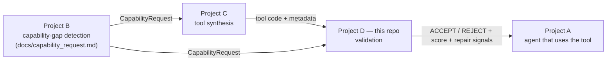
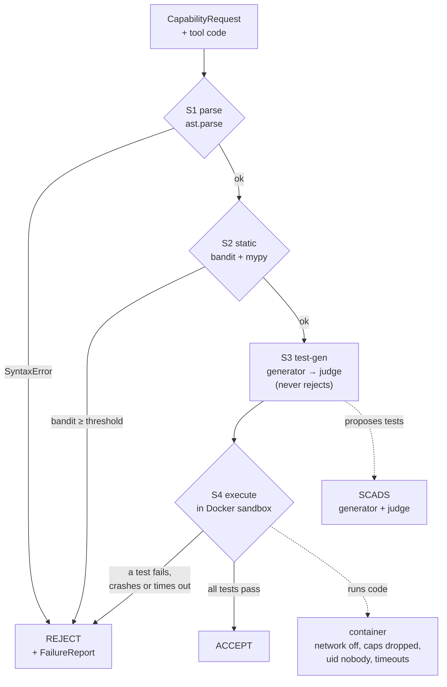

# Architecture

How the validator is put together, what each layer may and may not do, and how a
request becomes a verdict. Status and results: [reports/STATUS.md](reports/STATUS.md).
Prompts: [PROMPTS.md](PROMPTS.md). LLM configuration: [LLM.md](LLM.md).

---

## 1. Where this sits

The validator is **Project D** in a chain. Project B detects a capability gap and emits
a **Capability Request**; something synthesizes a tool for it; we decide whether that
tool is fit to use.



`CapabilityRequest` is **byte-identical to Project B's schema** (`name`, `capability`,
`description`, `inputs`, `outputs`, `rationale`). Their JSON loads here unchanged, and a
test asserts it against the example in `docs/capability_request.md` §2.

Because upstream requests carry no example I/O, sample cases are **not** part of the
request: they belong to whatever dataset supplies them (`RunBugRunEntry.examples`).

---

## 2. Layers, and what each may do

```
   pipeline.py          decides the verdict          deterministic Python, no LLM
     stages/sN_*.py     one check each               returns StageResult, never raises
                                                     for expected failures
       agents/          bounded multi-step policy    LangGraph; proposes only
         skills/        one prompt = one call        parses defensively
           prompts/     versioned prompt text        no I/O
             llm/       the only network egress      every call traced
       sandbox/         the only code execution      Docker, network off, caps dropped
```

Two rules give the project its spine, and both are enforced by tests:

- **The verdict is deterministic.** An LLM only ever *proposes* — tests, mutants,
  explanations, schemas. No LLM call sits in the control flow that decides
  ACCEPT/REJECT (CLAUDE.md rule 5).
- **Tool code runs only in the sandbox.** Parsing and static analysis read source
  without executing it, so they run on the host; anything that runs the tool goes
  through `sandbox/`.

A third rule keeps the LangGraph bet cheap to abandon: **only `agents/` may import
langgraph**, so removing the graphs leaves prompts, tracing, replay and skills intact.

---

## 3. Module map

| Module | Job |
|---|---|
| `contracts.py` | Every shared type. Depends on nothing internal. |
| `config.py` | Settings from environment over `.env`: LLM, sandbox, static, execution. |
| `pipeline.py` | Runs stages in order; first failure → REJECT + FailureReport. |
| `repair.py` | Turns a failed stage into a repair signal. |
| `cli.py` | Thin entry point: `validate`, `prompts`. |
| `stages/s1_parse.py` | `ast.parse`; syntax errors and parser overflow. |
| `stages/s2_static.py` | bandit (hard gate) + mypy (soft signal). |
| `stages/s3_testgen.py` | Generate tests, judge them, record the accepted ones. |
| `stages/s4_execute.py` | Run the tool against tests in the sandbox; picks the mode. |
| `stages/harness.py` | The scripts that run inside the container, and text comparison. |
| `stages/compare.py` | Structural comparison of typed outputs. |
| `sandbox/container.py` | Provision and destroy the locked-down container. |
| `sandbox/exec.py` | Run a script inside it; `NoExecutionSandbox` for static-only runs. |
| `sandbox/Dockerfile` | The sandbox image (pinned base + numpy, mutmut, pytest). |
| `llm/scads_client.py` | One `complete(role, system, user)`; roles resolve to pinned models. |
| `llm/trace.py` | One JSONL row per call: provenance, tokens, latency, ok/error. |
| `llm/replay.py` | Re-derive a result offline from a trace; a miss raises. |
| `prompts/` | Versioned prompt registry; `docs/PROMPTS.md` is generated from it. |
| `testgen/` | Generator and judge (delegating to the registry) + LLM payload types. |
| `data/loaders/runbugrun.py` | RunBugRun + CodeNet → requests, tests, examples, labels. |
| `experiments/` | What you run: sampling, parallel execution, metrics, results. |

Not built yet: `stages/s5_mutation.py`, `stages/s5b_rubberduck.py`, `stages/s6_score.py`,
`stages/s7_mcp_schema.py`, `mutation/`, `scoring/`, `agents/`, `skills/`.

---

## 4. How one tool is validated



The dotted edges are the two boundaries: LLMs only feed S3, and execution only happens
inside the container. Stages after S4 (mutation, rubber-duck, score, MCP schema) are
planned and slot in before the verdict, with the score deciding ACCEPT vs NEEDS_REVIEW.

### Execution modes

`s4_execute.execution_mode(request)` reads the **declared inputs** and picks:

| Request declares | Mode | How the tool is invoked | Comparison |
|---|---|---|---|
| only `stdin` (or nothing) | `stdin` | feed stdin, read stdout | text, trailing whitespace ignored, numeric tolerance only for fractional expectations |
| named typed parameters | `function` | import the module, call the entrypoint with keyword arguments | structural, numbers to a tolerance |

Both modes run **every test for one tool in a single container call**: a harness we
write runs each case as a subprocess, caps its output with `RLIMIT_FSIZE`, enforces a
per-case timeout, compares inside the container, and returns only verdicts plus short
previews. That measured about 26 ms per test versus ~300 ms when each case needed its
own call. In function mode the tool's own `stdout` is redirected to stderr, so a tool
that prints cannot corrupt the harness's JSON reply.

---

## 5. Data that comes out

| Artifact | Where | Contents |
|---|---|---|
| `ValidationRecord` | in memory / CLI JSON | request, every `StageResult`, failures, verdict |
| `ToolOutcome` rows | `results/*/…jsonl` | one row per tool per configuration |
| Summary | `results/*.summary.json` | slip rate, false-rejection rate, per-category recall, cost, run config |
| LLM trace | `results/<run_id>/llm_calls.<pid>.jsonl` | one row per call: prompt id + version, requested vs served model, tokens, latency, ok/error |

The trace is what makes the cost table, the RQ3 ablations, and offline replay possible.
`ReplayClient` answers from it and **raises on a miss**, so a re-derived number can never
quietly come from a fresh network call.

---

## 6. Deliberate non-goals

- **No bit-level reproducibility claim.** A hosted mixture-of-experts endpoint is not
  deterministic even at temperature 0. What is reproducible: the *procedure* (seed,
  prompt version, model actually served, budgets) and the *artifacts* (via replay).
- **No LLM in the verdict.** Removing every LLM leaves a working, if weaker, validator.
- **No host execution.** There is no "just to test quickly" path.
