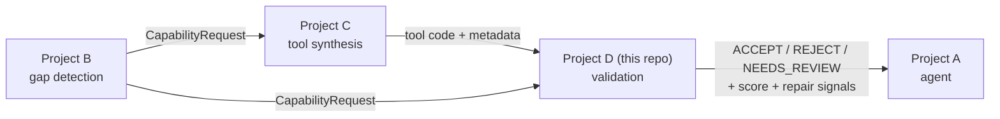
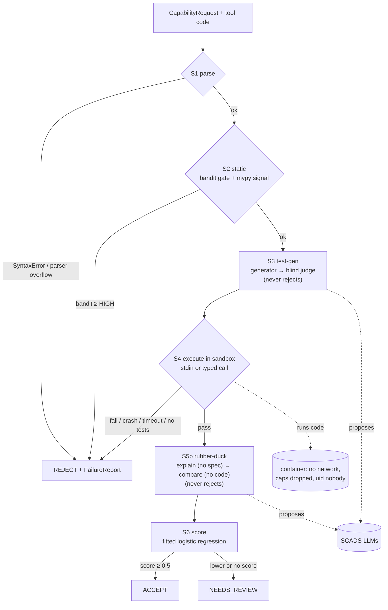
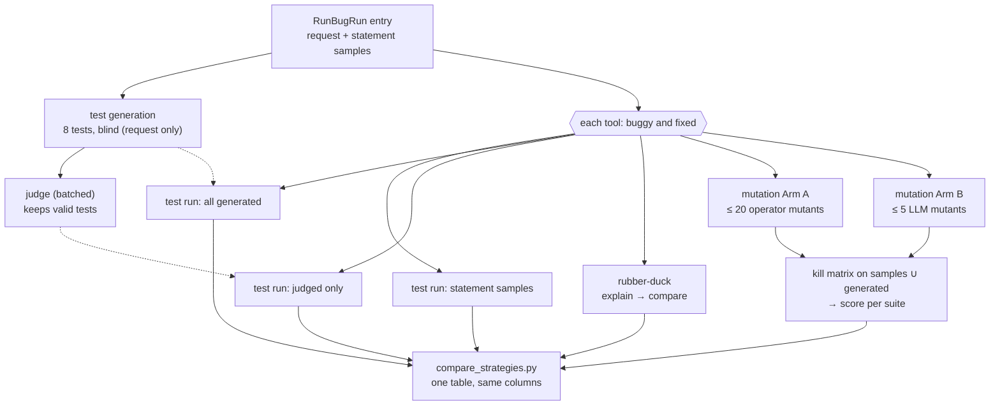

# Project Log — everything so far, in one file

**Project D: a validation layer for LLM-synthesized tools.** Author: Sohaib Ashraf (TU
Dresden). This file is the single place to see **what exists, how it fits together,
what happened when, what was decided, and what the numbers are**. It summarises and
links; the detailed sources are listed in §9.

**Last updated:** 2026-10-02 (after Day 14 of the 14-day plan in `PLAN.md`) · branch `main` ·
gate green: **457 tests, 0 skipped**.

**Stage names used below:** S1 **syntax check** · S2 **static analysis** (bandit + mypy) ·
S3 **test generation** (LLM writes tests from the task) · S4 **test run** (in the sandbox) ·
S5 **mutation** (how strong the tests are; experiment only) · S5b **rubber-duck** (one LLM explains
the code, another checks it against the task) · S6 **score** · S7 **MCP schema**.

> Rule for this file: every number comes from a real run and says where it came from;
> anything estimated says "estimate". Append to §5 (timeline) and §7 (results) as work
> lands; update §1 and §8 when the state changes.

---

## 1. State at a glance

| Research question | What answers it | State (2026-10-02) |
|---|---|---|
| **RQ1** slip rate, naive vs sandboxed | `run_static_vs_dynamic.py` | ✅ **Tier 1 done** (1,999 entries): static slip 100%, execution 0.35% |
| **RQ2** static alone vs dynamic *(headline)* | same runner | ✅ static recall 0.00 in all 11 categories; execution ≥ 0.994 |
| **RQ3** tests from the request, best strategy | `run_testgen_strategies.py`, `run_mutation_arms.py`, `compare_strategies.py` | ✅ eval done (274/300 entries): generated 89.8% vs samples 74.5%; side-by-side table with mutation on 100 entries (§7.1c) |
| **RQ4** reliability score correlates with correctness | `fit_reliability_score.py` | ✅ out-of-fold AUC 0.966, ρ 0.808, Brier 0.058 |
| **RQ5** MCP schema accuracy | S7 + `run_mcp_accuracy.py` | ✅ 23 real MCP tools: inputs exact in 138/138 LLM schemas; output schema valid in 74–80% (§7.1d) |

| Stage | State |
|---|---|
| S1 parse · S2 static · S3 test-gen · S4 execute (stdin + typed) | ✅ built, tested, S4 verified in real Docker |
| S5b rubber-duck | ✅ built; `compare_explanation@v2` tuned on the dev set |
| S6 score | ✅ stage + pipeline mapping (score ≥ 0.5 → ACCEPT, else NEEDS_REVIEW); deployed model `results/rq4/score_model.json` |
| S5 mutation (arms A, B) | ✅ built and tested; 100-entry run + side-by-side comparison done 2026-09-29 (§7.1c); not in `pipeline.py` |
| S7 MCP schema | ✅ built (`generate_mcp_schema@v1` + structural check); RQ5 run done |

**Schedule reality:** PLAN.md wanted all experiments done by Day 10. RQ1–RQ4 have results as
of the end of Day 10; S5 mutation and the strategy comparison landed on Days 12–13;
RQ5, rubber-duck agreement, judge independence and the S6 stage landed after Day 14 (2026-10-02): every PLAN.md item now has a result. Commits happened on Days 1, 2, 7, 8, 10 (none on Days 3–6 or 9); Days 12–13 are committed step by step by Sohaib.

---

## 2. What the system is

Project D sits in a chain: **B** detects a capability gap and emits a *Capability
Request*; **C** synthesizes a tool; **D (this repo)** decides whether the tool is fit to
use; **A** is the agent that uses it.



Input: tool code + a Capability Request in Project B's schema, verbatim (`name`,
`capability`, `description`, typed `inputs`/`outputs`, `rationale`). Output: a verdict, a
reliability score and structured repair signals. It is a **research project**: the
deliverable is experiments + a report, evaluated on **RunBugRun** (Python subset), whose
human-written bugs stand in for synthesized-tool errors (stated as a limitation).

---

## 3. Architecture

### 3.1 Layers and what each may do

```
pipeline.py        decides the verdict          deterministic Python, no LLM
  stages/sN_*.py   one check each               f(artifact, record, sandbox) -> StageResult
    scoring/       signals + fitted model       plain Python + scikit-learn
    prompts/       versioned prompt text        no I/O; docs/PROMPTS.md generated from it
    testgen/       generator + judge wrappers   parse LLM output defensively
      llm/         the only network egress      every call traced; 429s waited out
  sandbox/         the only code execution      Docker, network off, caps dropped
data/loaders/      RunBugRun + CodeNet → requests, tests, examples, labels
experiments/       what you run                 sampling, parallel runs, metrics, results
```

Invariants — rules that must hold at all times, however the code changes (1–4 are enforced by tests):
1. **The verdict is deterministic.** LLMs only *propose* (tests, explanations). S3 and S5b
   always pass; they record signals, never decide (CLAUDE.md rule 5).
2. **Tool code runs only in the container.** S1/S2 read source on the host; anything that
   executes the tool goes through `sandbox/`.
3. **Infrastructure failures raise; they never become verdicts** (bandit/mypy crash,
   harness error, unusable LLM output, persistent rate limit).
4. **Missing is missing.** A signal that was not produced is `None`, never a guessed 0 or 1.
5. **Only `agents/` may import langgraph** (planned layer, not built), so it is cheap to drop.
   *No test enforces this yet;* it holds today because nothing imports langgraph at all.

### 3.2 How one tool is validated



The pipeline runs stages in order; the **first failed stage short-circuits to REJECT**
and produces a `FailureReport` (the repair signal). With no S6 result, all-pass means ACCEPT; the S6
stage maps the score to ACCEPT vs NEEDS_REVIEW (built 2026-10-02, threshold 0.5).

### 3.2b The experiment: every strategy in parallel on every tool

The pipeline above stops at the first failed stage. The **experiment** does not: RQ3 and the
mutation run apply every strategy to every tool, so all rows of the comparison (STATUS §4.8)
are measured on the same tools. Only the S1/S2 hard gates short-circuit (they never fired).



RQ3 (`run_testgen_strategies.py`) produced the test-run and rubber-duck columns on 274 entries;
`run_mutation_arms.py` rebuilt 100 of those suites from the RQ3 trace (no regeneration) and
added the mutation columns.

### 3.3 Shared types (`contracts.py`, the spine)

| Type | Shape / role |
|---|---|
| `CapabilityRequest` | Project B schema verbatim: `name`, `capability`, `description`, `inputs`/`outputs: list[ParamSpec]`, `rationale` |
| `ParamSpec` | `name`, `type`, `description`, `required` |
| `IOExample` | `input`, `output` (any JSON: stdin text or typed kwargs) — not part of the request |
| `ToolArtifact` | `tool_id`, `code`, `metadata` |
| `StageResult` | `stage`, `passed`, `category`, `detail`, `data` |
| `ValidationRecord` | request + all `StageResult`s + `failures` + `verdict` (mutable accumulator) |
| `FailureReport` | `stage`, `category`, `message`, `line` |
| `Verdict` | `ACCEPT` · `REJECT` · `NEEDS_REVIEW` |
| `Sandbox` (Protocol), `ExecResult`, `Stage` | the execution boundary and the stage signature |

### 3.4 Stages in detail

| Stage | File | What it does | Fails on |
|---|---|---|---|
| S1 parse | `stages/s1_parse.py` | `ast.parse` | syntax error, parser overflow |
| S2 static | `stages/s2_static.py` | bandit (subprocess) + mypy (in-process, own config) | bandit finding ≥ HIGH (configurable); mypy is a signal only |
| S3 test-gen | `stages/s3_testgen.py` | generator proposes *n* tests; judge (other model family, **blind to code**) keeps valid ones — one call per test or one batched call per suite; a prebuilt suite can be recorded for several tools (RQ3 shares one per entry) | never |
| S4 execute | `stages/s4_execute.py`, `harness.py`, `compare.py` | runs **all** tests in one container call; mode from declared inputs (`stdin` → text; typed params → import + call) | wrong output, crash, timeout, `no_tests`, `no_entrypoint` |
| S5 mutation | `stages/s5_mutation.py`, `mutation/` | runs the tool and each mutant (Arm A operators or Arm B LLM) against the tests in the sandbox; `mutation_score = killed / mutants` (experiment only, not in `pipeline.py`) | never |
| S5b rubber-duck | `stages/s5b_rubberduck.py` | explainer sees code only; comparer (`compare_explanation@v2`) sees request + explanation only, returns met/violated/unknown per requirement; `semantics_score = met/(met+violated)` computed in Python | never |
| S6 score | `stages/s6_score.py`, `scoring/` | signals → P(correct) with the deployed model; the pipeline maps an all-pass record to ACCEPT (≥ threshold) or NEEDS_REVIEW | never |
| S7 MCP schema | `stages/s7_mcp_schema.py` | generator writes the MCP Tool object from request + code (`generate_mcp_schema@v1`); structure checked in Python | never |

**Output comparison (S4):** trailing whitespace ignored; tokens compared exactly, except
numbers get `math.isclose` (1e-6) **only when the expected token is fractional** — tolerance
everywhere hid 4 real int-vs-float bugs. 10 s per test. Inside the container each test's
output goes to `case.out`/`case.err` (the runner's own reply files are `out`/`err`; sharing
those names corrupted the reply — fixed 2026-09-26).

### 3.5 Sandbox (the safety boundary)

One **fresh container per tool**, force-removed after. Network disabled; memory + swap 512 MB;
128 pids; **all capabilities dropped**; `no-new-privileges`; uid 65534 (nobody); no host
mounts; per-test timeout kills the process group; stdout/stderr capped with
`RLIMIT_FSIZE`. Image `toolvalidator-sandbox:py3.12` = digest-pinned `python:3.12-slim` +
numpy 1.26.4 + mutmut 3.8.0 + pytest 9.1.1. Verified by `docker_probe.py` and real-Docker
tests (no leftover containers).

### 3.6 Reliability score (`scoring/`)

- **`signals.py`** — per tool: `bandit_findings`, `mypy_error_count`, `test_pass_rate`,
  `tests_run`, `semantics_score`, `semantic_violation`, `mutation_score` (from S5, arm A by
  default, only when measured on generated tests).
  **Leakage guard:** `test_pass_rate` counts only if S3 ran before S4 (generated tests);
  the dataset's own tests are the ground truth and never an input.
- **`model.py`** — logistic regression (standardised), **out-of-fold** predictions with
  folds **grouped by `problem_id`**; reports AUC, Spearman ρ, Brier, calibration bins,
  learned coefficients, and a drop-one-signal ablation. Missing values → `0 + <name>_missing`;
  never-observed signals dropped and listed. Hard gates (S1, S2 bandit) stay outside.
  `ScoreModel` / `fit_model` / `predict`: the deployed S6 model as plain numbers
  (`results/rq4/score_model.json`); `predict` returns None for a signal missing that was never
  missing in fitting. **`metrics.py`** — AUC, Spearman, calibration bins (split out 2026-10-02).

### 3.7 LLM layer

| Role | Model (pinned) | Sees | Limit on this key (measured 2026-09-24) |
|---|---|---|---|
| generator (S3 tests, S5b explain, S5 Arm B mutants, S7 MCP schemas) | `Qwen/Qwen3.8-27B` | request (+ code where allowed) | 120 req · 40,000 tokens / ~60 s |
| judge (S3 judge, S5b compare) | `zai-org/GLM-5.3-Flash` since 09-26 (was `GLM-5.3`: 30 req · 3,000 tokens) | request + candidate, **never code** | 60 req · 10,000 tokens / ~60 s |

- One client (`llm/scads_client.py`), temperature 0, defensive JSON parsing; waits for the
  stated reset on HTTP 429 (bounded, logged). `alias-*` model names are banned.
- **Completion caps** per call: judge 8,192 tokens, generator 16,384 (reasoning counts as
  completion; a Flash comparison once produced 11,860). A reply cut off at the cap raises
  `LLMOutputError` — it is never parsed.
- **Tracing** (`llm/trace.py`): one JSONL row per call — prompt id + version, requested vs
  served model, tokens, latency, ok/error. **Replay** (`llm/replay.py`) answers from a trace
  and raises on a miss.
- **Prompt registry** (`prompts/`): `generate_tests@v1`, `judge_test@v1`, `judge_batch@v1`
  (whole suite in one call), `explain_code@v1`, `compare_explanation@v1` and `@v2` (v2 is the
  S5b default: at most 6 requirements, do not solve the task), `invent_mutants@v1` (S5 arm B,
  generator, code only), `generate_mcp_schema@v1` (S7, generator, request + code). Released versions are immutable; `docs/PROMPTS.md` is generated
  and a test fails if it drifts.

### 3.8 Data

- **RunBugRun** Python: 145,370 entries (`train` 133,705 · `valid` 2,054 · `test` 9,611);
  each = buggy + fixed submission + bug-type labels. Programs are stdin/stdout scripts
  (median 10 lines). 321,418 tests; valid split: median 103 tests/problem, max 132.
- **Descriptions** are not in RunBugRun; they come from IBM CodeNet (3,924/3,926 problems).
  Median description 1,063 characters (valid split, 670 problems).
- Mapped onto the request schema as `solve_<problem_id>` with one `stdin`/`stdout` pair;
  statement sample I/O lives on the entry (`examples`), not on the request.
- **RQ5 data:** Project B's 23 FastMCP tools + the schemas that server sent
  (`data/loaders/mcp_tools.py`, read with `ast`; snapshot in git-ignored `data/mcp_tools/`).
- Experiments use `valid` + `test` (11,665 entries), seeded, ≤ 2 entries per problem.
  Tier 1: 2,000 entries (4,000 tools). Tier 2 (LLM): 300 entries + disjoint 50-entry dev set.

### 3.9 Experiments (what you run)

| Runner | Answers | What it does |
|---|---|---|
| `run_static_vs_dynamic.py` | RQ1, RQ2 | per tool: static-only vs static + execution on the dataset's own tests; `--max-tests` cap (0 = all) |
| `run_testgen_strategies.py` | RQ3 | per entry: one blind 8-test suite, batch-judged; per tool: S4 on `examples` / `generated` / `judged` arms + S5b; `--set dev\|eval`; appends per entry, resumes |
| `fit_reliability_score.py` | RQ4 | fits the score on RQ3 rows (label = variant, group = problem); full fit + named signal sets (all, without S5b, tests only, S5b only, static only; + mutation sets when rows carry a mutation score) |
| `run_mutation_arms.py` | RQ3 (mutation) | 100 completed RQ3 eval entries; suites replayed per entry from the RQ3 trace; per tool Arm A + Arm B mutants, kill matrix on samples ∪ generated, score per suite; checks against RQ3 |
| `run_rubberduck_agreement.py` | PLAN §4.2 | re-runs the rubber-duck on 50 tools; verdict/score agreement with RQ3 |
| `run_judge_independence.py` | PLAN §6.5 | same-model (Qwen) vs other-family (GLM) judge on 100 replayed suites; ground truth from container runs |
| `run_mcp_accuracy.py` | RQ5 | signature baseline vs S7 with / without type hints, 3 runs, scored against the real schemas |
| `compare_strategies.py` | RQ3 + RQ4 | one table of every strategy (bugs caught, correct rejected, mutation score A/B, LLM tokens/seconds per entry), Arm A vs B agreement, RQ4 refit with `mutation_score` |

Shared plumbing in `common.py`: seeded sampling (≤ 2 per problem), per-entry test cap,
worker count from CPUs and Docker memory, JSONL IO. Tier 2 dev = first 50 of the seeded
order, eval = next 300, so Tier 2 is a subset of Tier 1.

### 3.10 Module inventory (lines · tests)

| Module | Lines | Test file (tests) |
|---|---|---|
| `contracts.py` | 128 | `test_contracts.py` (24) |
| `config.py` | 119 | `test_config.py` (11) |
| `pipeline.py` · `repair.py` · `cli.py` | 53 · 27 · 64 | `test_pipeline.py` (8) · `test_repair.py` (4) · `test_cli.py` (6) |
| `stages/s1_parse.py` · `s2_static.py` | 30 · 138 | 8 · 12 |
| `stages/s3_testgen.py` | 61 | 6 |
| `stages/s4_execute.py` · `harness.py` · `compare.py` | 193 · 210 · 48 | 58 · — · 19 |
| `stages/s5b_rubberduck.py` | 123 | 13 |
| `scoring/signals.py` · `model.py` | 79 · 211 | 6 · 7 |
| `testgen/generator.py` · `judge.py` · `schemas.py` | 45 · 39 · 54 | 8 · 5 · 9 |
| `prompts/` (`spec`, `testgen`, `rubberduck`, `__init__`) | 76 · 127 · 99 · 29 | `test_registry.py` (9) |
| `llm/scads_client.py` · `trace.py` · `replay.py` | 162 · 210 · 72 | 19 · 8 · 8 |
| `sandbox/container.py` · `exec.py` | 42 · 150 | 3 · 16 |
| `data/loaders/runbugrun.py` | 219 | 10 |
| `experiments/common.py` · `run_static_vs_dynamic.py` | 223 · 132 | 18 · 1 |

Table above is as of Day 8. **Day 10 totals: ~3,760 lines of code; 322 tests, 32 marked `slow`** (real Docker, real SCADS, real dataset). Added on Day 10: `experiments/run_testgen_strategies.py` (364), `experiments/fit_reliability_score.py` (60). Over the ~200-line guideline: `run_testgen_strategies.py` (364), `common.py` (223), `harness.py` (212), `model.py` (211), `trace.py` (210) — flagged; splitting the first two needs new files (to be approved).
**Added Days 12–13 (lines · tests):** `mutation/__init__.py` (types) · `arm_a_mutmut.py` 177 · 34 ·
`arm_b_llm.py` 79 · 9 · `kill.py` 92 · 10; `stages/s5_mutation.py` 67 · 4; `prompts/mutation.py`
49; `experiments/run_mutation_arms.py` 373 · 11; `experiments/compare_strategies.py` 293 · 8;
`s4_execute.py` now 250. **Totals: 409 tests.**
**Added 2026-10-02 (lines · tests):** `scoring/metrics.py` 70 · 1 (moved); `scoring/model.py` now
208 (+3); `stages/s6_score.py` 36 · 2; `stages/s7_mcp_schema.py` 80 · 11; `prompts/mcp.py` 64;
`pipeline.py` 66 (+5); `config.py` 133 (+1); `data/loaders/mcp_tools.py` 132 · 5;
`run_rubberduck_agreement.py` 229 · 6; `run_judge_independence.py` 233 · 4;
`run_mcp_accuracy.py` 309 · 9. **Totals: 457 tests.**

---

## 4. How work is done here

Test first and watch it fail → implement → full gate
(`ruff format . && ruff check . && mypy --strict toolvalidator data experiments && pytest -q`)
→ one logical change per commit (`<area>: <summary>`), refactors never mixed with features.
Ask before changing `contracts.py`, the pipeline contract, adding a dependency, or a new
top-level module. Details: `WORKFLOW.md`, `CLAUDE.md`.

---

## 5. Timeline

### Day 0 — setup
Scaffold docs (CLAUDE.md, PLAN, STRUCTURE, MEMORY). Locked decisions: fresh codebase;
RunBugRun Python only; all three research components in scope; static checks minimal
(bandit + mypy); score fit from data; LLM never decides a verdict.

### Day 1 — 2026-09-17 · Sprint 1 (the spine) and most of Sprint 2 · 37 commits
- Skeleton, contracts, config, S1, S2, repair, pipeline, `NoExecutionSandbox`, CLI + examples
  → static pipeline end-to-end (71 tests).
- Pre-flight: `docker_probe.py` ALL CHECKS PASSED; SCADS models pinned; RunBugRun inspected
  (stdin/stdout scripts, no descriptions → CodeNet).
- RunBugRun loader; Docker sandbox (container + execution, output caps). Smoke: 10 real
  entries, 0 leftover containers. **Sprint 1 complete, 96 tests, tagged `sprint-1`.**
- Sandbox image with numpy + mutmut; mutmut verified in-container (0 mutants on module-level
  scripts → arm A needs wrapping). Experiment scale decided (tiers, workers).
- SCADS client; S4 execute (batched); experiment plumbing + RQ1/RQ2 runner; **pilot run 1**.
- Float-tolerance + 10 s timeout (run 2); testgen types, generator, judge, S3; S4 consumes
  S3 tests; tolerance restricted to fractional answers (run 3). STATUS report written.

### Day 2 — 2026-09-18 · 4 commits
Run-3 decision recorded; langgraph pinned; **LLM call tracing**; **offline replay**.

### Days 3–6 — no commits.

### Day 7 — 2026-09-23 · alignment · 5 commits
Adopted **Project B's CapabilityRequest verbatim** (examples moved to the dataset entry);
split S4 into stage + `harness.py` + `compare.py`; **typed function-call mode**; versioned
**prompt registry** + generated PROMPTS.md; ARCHITECTURE/LLM/WORKFLOW docs. Docker was down:
22 slow tests skipped, typed mode unverified.

### Day 8 — 2026-09-24 · verification + S5b/S6 · 11 commits
- Real Docker runs found typed mode **broken in-container** (missing `from typing import Any`
  in injected harness source) and stderr previews hiding exception types → fixed. HANDOFF written.
- S5b rubber-duck + its two prompts; S3 calls now traced with prompt ids.
- **SCADS rate limits discovered** (judge 3,000 tokens / ~60 s) → client waits out 429s.
- `scoring/signals.py` (leakage guard caught a real bug in its first version) and
  `scoring/model.py`.
- 25-test cap implemented and **capped pilot** run (§7.2).

### Day 10 — 2026-09-26 · decisions, RQ3 build, dev run, fixes, runs launched
- Decisions approved (below); this log created.
- `judge_batch@v1`: one judge call per suite (1,412 tokens for 8 tests on a real problem).
- S3 can record a prebuilt suite; RQ3 runner (arms `examples`/`generated`/`judged` + S5b)
  and RQ4 runner (`fit_reliability_score.py`) built.
- **Judge switched to GLM-5.3-Flash**: GLM-5.3's 3,000-token window could not serve one
  S5b comparison (a Flash comparison later ran to 11,860 completion tokens). Completion
  caps added (judge 8,192, generator 16,384); truncation raises.
- **Dev run (50 entries, 37 min)** surfaced a real **sandbox harness bug** (per-test files
  clashed with the runner's reply files; fixed with a real-Docker regression test),
  runaway comparisons (→ `compare_explanation@v2`), and missing failed-test indices.
- Launched the **RQ3 eval run (300 entries)** and the **Tier 1 RQ1/RQ2 run (2,000
  entries, all tests)** in parallel. Mid-run, the eval showed 26% of comparisons still
  truncated; a probe of reasoning controls (`reasoning_effort=low`, two "disable thinking"
  switches) was inconclusive (n = 1 each, still 5–7k completion tokens), so the run continued
  and the missing semantic signal is reported, not imputed.
- **Both runs finished.** RQ3 eval: 274/300 entries in 12,270 s (26 lost to LLM failures).
  Tier 1: 1,999 entries in 12,525 s (1 analyzer error). RQ4 fitted on the RQ3 rows; the
  runner gained **named signal sets** after one-at-a-time ablation hid S5b's value
  (its two signals substitute for each other). Results in §7.1b and `STATUS.md` §4.5–4.7.
- Decisions approved by Sohaib this day: batch-judge a suite in one call (GLM-5.3-Flash as
  fallback, then adopted); **RQ3 tests once per entry, blind to code, shared by buggy and
  fixed**; RQ1/RQ2 headline = all tests, cap as sensitivity; S6 may change the verdict mapping.

### Days 11–13 — 2026-09-27/29 · history clean-up, mutation plan, mutation built and run, comparison
- At Sohaib's request, removed the `Co-Authored-By: Claude` line from all 72 commit messages
  (local history only; code unchanged; docs' commit hashes updated; backup branch kept).
- Clarified in this log what the invariants are; the langgraph rule has no test yet.
- Confirmed the RQ3 experiment already runs every strategy on every tool in parallel; the
  §3.2 diagram shows the production pipeline, not the experiment.
- Wrote the plan for **mutation (Arm A operator mutants, Arm B LLM mutants)** and **one
  side-by-side comparison of every strategy** on 100 RQ3 entries — awaiting Sohaib's review.
- New working agreements: Sohaib makes all commits; no AI attribution (HANDOFF §0).
- Sohaib said "implement" (2026-09-28). Defaults taken on the three open points: Arm A uses
  our own `ast` engine with mutmut's operator classes (deviation from locked decision 3, to be
  recorded in DECISIONS.md); new files `prompts/mutation.py`, `experiments/run_mutation_arms.py`,
  `experiments/compare_strategies.py` get added to STRUCTURE.md; the mutation stage stays out of
  `pipeline.py` for now (experiment only).
- **Step 1 (refactor, no behaviour change):** the test run gained `run_cases(code, request,
  cases, sandbox)`, which returns **every** test's pass/fail (`CasesRun`), because the stage
  result lists at most 5 failures and kill counting needs all of them. `run` now calls it.
  +5 tests (1 real Docker: 8 tests, 7 failing, all listed in order). Gate: 328 passed, 0 skipped.
- **Step 2: Arm A mutant maker** (`mutation/arm_a_mutmut.py`, 177 lines; `Mutant`/`MutantSet`
  in `mutation/__init__.py`). mutmut's operator classes on an `ast` engine, source only; ≤ 20
  mutants per tool in a seeded order; unparsable/unchanged/duplicate dropped and counted.
  Example: `if a < b:` → mutant `if a <= b:`, described `line 1: < -> <=`. +34 tests.
  Probe (not a result): 200 real `fixed` programs → 2,305 mutants (median 10.5, max 20),
  0 dropped, 2 programs with nothing to mutate. Decision recorded in DECISIONS.md;
  MEMORY locked decision 3 updated. Gate: 362 passed, 0 skipped.
- **Step 3: Arm B LLM mutants** (`mutation/arm_b_llm.py`, 79 lines; prompt `invent_mutants@v1`
  in `prompts/mutation.py`, generator role, **code only**). One call per tool asks for 5
  whole-program variants, each with one realistic mistake; candidates that are not an object
  with `code`, do not parse, equal the original or an earlier one by syntax tree (so a
  comment-only change is dropped), or exceed 5 are dropped and counted; a reply with no JSON
  raises. PROMPTS.md regenerated. +10 tests (1 real Qwen call).
  Probe (1 real call, not a result): entry 9080 (sort 10 numbers, print the top 3) → 5 returned,
  5 kept, 12.4 s: `a[9]`→`a[8]`, `a[8]`→`a[7]`, `a[7]`→`a[6]`, `range(10)`→`range(11)`, and one
  4-line "sort descending" variant (one idea, but more than the one small edit asked for).
  Gate: 372 passed, 0 skipped.
- **Step 4: kill counting** (`mutation/kill.py`, 88 lines). `run_matrix` runs the tool and
  each mutant once against the whole (union) suite, one sandbox call per program, giving a
  pass/fail matrix; `suite_score(matrix, indices)` scores any sub-suite from it. A test kills a
  mutant iff the tool passes it and the mutant fails it; score = killed / mutants, **None**
  when there are no mutants or the suite is empty (missing, not 0). A program whose whole
  call times out fails every test. Raw score, not adjusted for equivalent mutants.
  Example (real Docker): tool `n+1`, tests `1→2`, `5→6`; mutants `n-1` (killed by both),
  "wrong only when n ≥ 5" (killed by test 2 only), `1+n` (equivalent, never killed), an
  infinite loop (times out → killed) → 3 of 4 killed; test 1 alone kills 2.
  Mutants use the same per-test timeout as the tool (10 s) and run in the tool's container,
  as the RQ3 arms already do. A looping mutant costs up to 10 s × tests; the smoke run
  (step 6) measures how much that is. +9 tests (1 real Docker). Gate: 381 passed, 0 skipped.
- **Step 5: mutation stage** (`stages/s5_mutation.py`, 67 lines) + `mutation_score` signal.
  `run(artifact, record, sandbox, mutants=..., arm="A"|"B")` scores the tests S3 accepted
  (or given tests) against the mutants and **always passes** (it measures tests, not the
  tool); records `mutation_score`, `killed`, `total`, `usable_tests`, `tests`, `candidates`,
  `dropped`, `from_s3`, `seconds`; category `no_tests` / `no_mutants` with a missing score.
  Not wired into `pipeline.py` (experiment only, as agreed). `scoring/signals.py` now fills
  `mutation_score` from the last S5 result of arm A (arm B on request) **only when S5 ran on
  S3's generated tests** — same leakage guard as the pass rate: mutation measured on the
  dataset's own tests would leak the label (a buggy tool fails more of them, so fewer tests
  can kill). RQ3 records contain no S5, so the published RQ4 numbers are unchanged.
  `ByCodeSandbox` fake moved to `tests/conftest.py` (now used by two test files).
  +7 tests. Gate: 388 passed, 0 skipped.
- **Step 6: mutation experiment runner** (`experiments/run_mutation_arms.py`, 373 lines — over
  the size guideline, like the RQ3 runner; splitting needs a new file). Entries: the first 100
  RQ3 eval entries (seeded Tier-2 order) that RQ3 completed with both variants past the gates.
  **Suites rebuilt offline** from the RQ3 trace with `ReplayClient`, using only that entry's own
  successful calls: the trace has 61 generate/judge prompts that repeat across entries (two
  entries of one problem send the same blind prompt), so plain replay would hand one entry the
  other's suite; within an entry no prompt repeats. Rebuilt test counts must equal the RQ3 row
  or the entry raises. Per tool: Arm A (≤ 20, seed = entry id·2 + variant) and Arm B (1 Qwen call);
  each arm runs the tool + its mutants on the union suite (samples + generated) in a fresh
  container, with RQ3's timeout and tolerances (`run_matrix` now passes tolerances through);
  scores for `examples` / `generated` / `judged` come from that matrix. The tool's pass/fail per
  suite is compared with RQ3's row (`rq3_mismatches`) and between the two arms' runs
  (`tool_stable`). Arm B failure keeps Arm A, Arm B scores missing. +12 tests.
  Gate: 400 passed, 0 skipped.
  **Smoke (2 entries, 4 tools, `results/mutation_smoke/`, 75 s at 2 workers):** 0 errors, replay
  reproduced both RQ3 suites (11 and 12 tests), 0 RQ3 mismatches, 0 unstable tools; 19–39 s per
  tool; Arm A 6 and 20 mutants per tool (cap reached at 21–23 candidates), Arm B 5/5 kept. Entry
  185625's buggy tool passes all 12 tests, as in RQ3. Full run at 4 workers estimated ~25 min.
- **Mutation run (100 entries = 200 tools, `results/mutation/`, 2026-09-29):** 3,157 s wall
  clock at 4 workers (the ~25 min estimate was wrong: hanging mutants wait out 10 s per test —
  entry 375371 took 862 s and 786 s per tool); median 38 s per tool. **0 errors, 0 replay
  mismatches, 0 tools disagreeing with RQ3's pass/fail, 0 unstable tools, 0 Arm B failures.**
  Arm A: 2,337 mutants (median 12 per tool, 1–20), 0 dropped, 4,623 s sandbox time. Arm B:
  999 of 1,000 returned kept (1 dropped), median 5 per tool, 1,984 s sandbox time.
  Missing scores are empty suites, not failures: 2 entries (422370, 354749) have 0 generated
  tests (as in RQ3) and 1 entry (40082) has no statement samples. The judge rejected tests in
  only 1 of the 100 entries (337172), and those tests killed nothing extra, so `judged` =
  `generated` here. Mean mutation score (raw), per suite:

  | Arm | Tools | statement samples | generated | judged |
  |---|---|---|---|---|
  | A | fixed (n = 99/98/98) | 0.823 | 0.875 | 0.875 |
  | A | buggy | 0.386 | 0.454 | 0.454 |
  | B | fixed | 0.808 | 0.894 | 0.894 |
  | B | buggy | 0.372 | 0.429 | 0.429 |

  Buggy tools score lower because a test can only kill a mutant if the tool passes it, and
  buggy tools fail many tests. **Hand check (6 mutants on fixed tools, seeded pick):** all real
  and correctly killed — Arm A `r += self.num`→`-=` (161026), `index == 0`→`!=` (515865),
  `p + j - 50`→`+ 50` (40082, killed by a generated test); Arm B `math.pi`→`3.14` (281881,
  beyond the float tolerance), `range(1,n)`→`range(0,n)` (612038), `range(3)`→`range(4)`
  (676983); every Arm B description matched its code change.
- **Step 7: the side-by-side comparison** (`experiments/compare_strategies.py`, 293 lines — over
  the guideline) + `fit_rows(..., sets=...)` with `MUTATION_SETS` in `fit_reliability_score.py`
  (a local variable named `sets` shadowed the new parameter at first; the tests caught it,
  mypy did not). +9 tests. Gate: 409 passed, 0 skipped. Run on the 100 entries → STATUS §4.8
  and §7.1c below. Test-execution time per strategy was not recorded by RQ3, so the table
  reports LLM time only and says so. Diagram §3.2b added.

### After Day 14 — 2026-10-02 · every remaining PLAN.md item (plan `velvet-napping-grove.md`)
- Sohaib asked whether all experiments had run (they had not: RQ5, rubber-duck agreement, judge
  independence, S6 stage) and said "everything that was in the plan should be completed";
  RQ5 ground truth = real MCP tools from Project B, found on disk. Plan approved.
- **Rubber-duck agreement** (`run_rubberduck_agreement.py`, +6 tests; `kappa` made public in
  `compare_strategies.py`): 50 tools, verdict same in 43/44 (κ 0.95), score ρ 0.97, explanation
  text identical in 2/49.
- **Judge independence** (`run_judge_independence.py`, +4 tests; `AsGenerator` adapter so the
  config rule judge ≠ generator stays): 98 entries, 768 tests, 20 wrong; GLM caught 1, Qwen 2
  (+1 valid wrongly rejected); both judges give 89 bugs / 7 correct rejected of 98.
- **S6:** `scoring/metrics.py` split out of `model.py` (pure refactor, its own commit);
  `ScoreModel` + `fit_model` + `predict`; `stages/s6_score.py`; `pipeline.run_pipeline(...,
  accept_threshold=)`; `ScoreSettings` in config; `fit_reliability_score.py --model-out`. The
  refit reproduced AUC 0.966. +12 tests. Threshold trade-off measured (STATUS §4.11).
- **RQ5:** `data/loaders/mcp_tools.py` (+5 tests; never imports Project B), `prompts/mcp.py`
  (`generate_mcp_schema@v1`), `stages/s7_mcp_schema.py` (+11 tests; +1 registry test), `run_mcp_accuracy.py`
  (+9 tests). `.gitignore` gained `data/mcp_tools/` (Project B has no licence). Sanity check:
  the signature baseline scored 23/23 exact. Run: 138 calls, 0 errors (§7.1d).
- Mistakes caught on the way: a trailing `#` comment on a `.gitignore` line would have made the
  pattern match nothing (caught with `git check-ignore`); a `schema` field name clashed with
  pydantic and a `**dict` hid argument types from mypy (both removed); two test fixtures
  recorded 3-test suites while the code replayed 8 (replay refused, as it should).
- Gate: **457 passed, 0 skipped**.
- **Report written:** `docs/reports/Project_D_Report.docx` (Word, A4, ~4,000 words, 8 tables;
  Sohaib chose Word and "only what the repo cites" for related work). Built by a docx-js script
  kept outside the repo; schema-validated; numbers taken from `results/` via STATUS.md.
- **README rewritten** (Sohaib asked for diagrams with explanations): five Mermaid diagrams
  (project chain, one tool through the pipeline, the trust rules, module dependencies, data and
  experiments), a worked example (`a - b` for "print the sum": static analysis passes, the test
  run rejects), and real runner commands. The old README listed a never-built S0 stage, put
  example I/O on the request and gave wrong runner flags. Noted while writing it: the RQ1/RQ2
  runner defaults to the 25-test cap; the headline needs `--max-tests 0`.
### 2026-10-05 · test-quality metrics, coverage and per-problem tables (plan `quizzical-globe.md`)
- Sohaib asked what makes a test suite good and wants coverage + mutants, RunBugRun's own tests
  side by side with ours, and per-problem tables to read 30–50 problems. Chosen: line + branch
  coverage (stdlib `sys.monitoring` inside the container, no new dependency), bug reached,
  per-category detection, metric validity, mutation on the full dataset suite, paired statistics;
  on the 100 mutation entries. Plan approved.
- **Step 1:** `scoring/metrics.py` gained `mcnemar_exact` (exact two-sided binomial on discordant
  pairs), `bootstrap_mean_diff_ci` (seeded paired percentile interval) and `holm`. +9 tests.
  Cross-check (not a test): McNemar equals `scipy.stats.binomtest` on 300 random cases (max
  difference 2.2e-16).
- Review findings in the report (not yet fixed): references 1–2 lost their underscores
  (`run_bug_run_data`, `Project_CodeNet`, `problem_descriptions`) because the build script read
  `_…_` as italics; §1 calls the RQ wording "supervisor-approved", which no repo document records.

---

## 6. Decisions (index — full rationale in `DECISIONS.md`)

| Date | Decision |
|---|---|
| Day 0 | Fresh start; RunBugRun Python only; all 3 components in scope; minimal static checks; score fit from data |
| 09-17 | Python 3.12 `.venv`; only `toolvalidator` installable; gate type-checks `data/` + `experiments/` |
| 09-17 | Mutation arm A (mutmut) runs **inside** the sandbox |
| 09-17 | Contract shapes; `Sandbox` is a Protocol in contracts; config invents no defaults |
| 09-17 | S1: parser overflow fails, empty code passes · S2: bandit rejects at HIGH, mypy is a signal |
| 09-17 | Pipeline semantics before S6: first failure → REJECT, all pass → ACCEPT |
| 09-17 | Models: generator Qwen3.8-27B, judge GLM-5.3 (other family, blind to code) |
| 09-17 | Descriptions from CodeNet; loader behaviour; sandbox execution design |
| 09-17 | Real-infrastructure tests skip visibly, never pass vacuously |
| 09-17 | Sandbox image with numpy; mutmut yields no mutants on module-level scripts |
| 09-17 | Experiment scale: seeded tiers, ≤ 2 per problem, fresh container per tool, W workers |
| 09-17/18 | Output comparison: whitespace-insensitive, tolerance only for fractional answers |
| 09-23 | CapabilityRequest = Project B schema verbatim · S4 typed mode · prompt registry |
| 09-24 | S5b: blind explainer + blind comparer, score in Python, always passes |
| 09-24 | 25-test cap = seeded sample per entry (buggy and fixed see the same tests) |
| 09-24 | S6 inputs from generated tests only (leakage guard); missing → indicator |
| 09-26 | Batch judging; per-entry blind test generation; all-tests headline; S6 verdict mapping approved |
| 09-26 | Judge → `GLM-5.3-Flash` (GLM-5.3 window could not serve one call); completion caps; truncation raises; S5b failure keeps the entry with semantics missing |
| 09-26 | After the dev run: harness file-name fix, generator cap 16,384, failed-test indices per arm, `compare_explanation@v2` as default |
| 09-26 | RQ4 reports named signal sets (joint ablation), not only drop-one ablation |
| 09-28 | Mutation arm A = mutmut's operators on our own `ast` engine (supersedes "mutmut in the sandbox"); mutation measures test strength, never rejects; 100-entry subset |
| 10-02 | S6 deploys the "all" set without mutation, threshold 0.5; same-family judge = generator's own model via an experiment-only adapter; RQ5 on Project B's 23 real MCP tools (read with `ast`, not committed) with name + description only in the request |

---

## 7. Results so far (all real runs)

### 7.1 RQ1/RQ2 pilot — 200 entries (400 tools), seed 20260917, 10 workers, 0 errors

| Configuration | Slip (buggy accepted) | False rejection (fixed rejected) | unusable_fixed | s/tool |
|---|---|---|---|---|
| Static only (S1 + S2) | **200/200 = 100%** | 0/200 | — | ~0.5 (static part) |
| + execution, run 1 (exact text, 5 s) | 1/200 = 0.5% | 9/200 = 4.5% | 9 | 2.16 |
| + execution, run 2 (tolerance everywhere, 10 s) | 5/200 = 2.5% | 4/200 = 2.0% | 4 | 2.16 |
| **+ execution, run 3 (tolerance for fractional only) — headline** | **1/200 = 0.5%** | **4/200 = 2.0%** | 4 | 2.16 |
| run 3 + **25-test cap** (sensitivity) | **19/200 = 9.5%** | 3/200 = 1.5% | 3 | 1.33 |

- **Static analysis caught 0 bugs in all 11 bug categories.** Execution (run 3) recall 1.00
  everywhere except `call` 0.99.
- The one uncapped slip (entry 451069) passes all 103 of its own tests: dataset label noise.
- **The cap matters:** all 18 extra slips fail only 1–3 of ~103 tests uncapped (rare-input
  bugs); capped recall falls to 0.78–0.90 in most categories. 87% of problems have > 25 tests.
- Results: `results/pilot`, `pilot2`, `pilot3`, `pilot3_cap25` (git-ignored).

### 7.1b Final runs (Day 10) — full tables in `reports/STATUS.md` §4.5–4.7
- **Tier 1 RQ1/RQ2** (1,999 entries, all tests): static slip 100%, false rejection 0%;
  static + execution slip **0.35%** (7), false rejection **1.5%** (30 = all `unusable_fixed`).
- **RQ3** (274/300 eval entries, one blind 8-test suite per entry): bugs caught — statement
  samples 74.5%, generated 89.8%, judged 88.7%; correct tools rejected 2.2% / 8.0% / 5.5%.
  S5b flagged 87.7% of buggy vs 1.6% of fixed tools where it gave a verdict, and 12 of 18
  bugs the tests missed; its signal is missing for 16.6% of tools (more for buggy).
- **RQ4** (548 tools, out of fold, grouped by problem): AUC **0.966**, ρ **0.808**, Brier
  **0.058**; without S5b 0.927; tests only 0.931; static only 0.573.

### 7.1c Every strategy side by side (2026-09-29) — full table + caveats in `STATUS.md` §4.8
100 completed RQ3 eval entries = 200 tools, same tools for every row:

| Strategy | Bugs caught | Correct rejected | Mut. A (fixed) | Mut. B (fixed) | LLM tokens / entry |
|---|---|---|---|---|---|
| statement samples | 72% | 1% | 0.823 | 0.808 | 0 |
| generated | 92% | 8% | 0.875 | 0.894 | 2,658 |
| judged | 91% | 7% | 0.875 | 0.894 | 4,477 |
| rubber-duck alone | 63% | 2% | n/a | n/a | 6,307 |
| judged + rubber-duck | 94% | 8% | = judged | = judged | 10,784 |

- Arm A vs B per test: raw agreement 0.90, κ 0.03 (almost every test kills something of both);
  Spearman of per-tool scores 0.40 (fixed), 0.89 (buggy).
- RQ4 refit on these tools: all signals AUC 0.945; + mutation 0.944 (A) / 0.946 (B); tests only
  0.928; tests + mutation 0.950 (A) / 0.936 (B); mutation only 0.809 / 0.823.
- Draft conclusion (STATUS §4.8, for Sohaib's review): keep generated tests; the judge adds
  little here; rubber-duck adds 3 catches for ~6,300 tokens; mutation measures test strength
  but adds nothing to the reliability score.

### 7.1d After Day 14 (2026-10-02) — full tables in `STATUS.md` §4.9–4.12
- **Rubber-duck repeatability** (50 tools): verdict same in 43/44 (κ 0.95); score ρ 0.97;
  explanation wording identical in only 2/49; 4 missing per run (token cap).
- **Judge independence** (98 entries, 768 generated tests, 20 wrong): GLM-5.3-Flash rejected 1
  (caught 1), Qwen3.8-27B rejected 3 (caught 2, 1 valid); bugs caught 89 vs 89, correct tools
  rejected 7 vs 7 (no judge: 90 / 8). Independence makes no measurable difference here.
- **S6 threshold** (290 tools that pass every generated test: 259 correct, 31 buggy): at 0.5
  → 249 correct / 16 buggy ACCEPTed; 0.7 → 230 / 7; 0.3 → 257 / 18.
- **RQ5** (23 real MCP tools, 3 runs per condition): input schema exact in 69/69 with type hints
  and 69/69 without; signature baseline 23/23; valid MCP object 51/69 (with hints) and 55/69
  (without) — every failure is `outputSchema: {"type": "string"}`; output exactly `result:
  string` 19/69 and 17/69.

### 7.2 Measured costs
**Mutation run (Day 13):** 3,157 s for 100 entries at 4 workers; median 38 s per tool, max
862 s (hanging mutants wait out 10 s per test). Per entry: Arm A 46.2 s sandbox; Arm B 19.8 s
sandbox + 3,573 tokens / 47.5 s LLM.
**Real runs (Day 10):** RQ3 eval ~5,350 generator + ~6,180 judge tokens per completed entry,
12,270 s for 300 entries at 4 workers; Tier 1 3.13 s/tool at 6 workers — both while sharing
the machine, so inflated. Dev-run medians per call: generate 2,346 tokens / 14.5 s, batched
judge 1,584 / 9.2 s, explain 895 / 5.7 s, compare 2,066 / 23.0 s.
**Earlier:** static ~0.5 s/tool; one sandbox call ~0.3 s; 50 tests batched in one call 1.32 s (vs ~300 ms
per test unbatched). LLM, n = 1 each on a toy task: S3 judge 278 tokens / 3.7 s; S5b
compare 1,015 tokens / 45.5 s; S5b explain 486 tokens / 2.5 s. SCADS latency varies ~10x
between identical calls.

### 7.3 S5b first real run (2 toy tools, not a result)
Correct `max` program: 4 met, 0 violated (score 1.0). `min`-for-`max` bug: 3 met, 1 violated
(score 0.75), with the right evidence quoted.

---

## 8. Open items and known issues

1. **Next (2026-10-02):** the report is drafted (`docs/reports/Project_D_Report.docx`). Sohaib
   commits the uncommitted work (HANDOFF §3a), reviews the report, and picks the S6 threshold
   (STATUS §4.11) and the strategy conclusion (STATUS §4.8). The CLI still runs the static
   configuration only. The report's build script lives only in the session scratch folder.
1a. **Judge / repeatability caveats:** judge independence n = 98 entries with only 20 wrong
   tests, so the judges' recall rests on 1–2 catches; the same-family judge is the generator's
   own model under the generator's completion cap; rubber-duck repeatability on 50 tools.
1b. **Mutation caveats to carry into the report:** raw scores (equivalent mutants not removed);
   "mutation only" partly re-encodes the pass rate; n = 100 entries, no significance tests;
   subset = first 100 *completed* RQ3 entries; test-execution time per strategy not recorded.
1c. **RQ5 caveats:** 23 small tools from one server; the reference is derived from the same
   type hints the signature baseline reads; output accuracy mostly measures knowledge of
   FastMCP's `result` wrapping; complexity correlation undefined (input F1 = 1.0 everywhere).
2. **RQ3 caveats to carry into the report:** 26/300 entries lost to LLM failures (likely
   the harder problems); S5b signal missing for 16.6% of tools, more for buggy (62) than
   fixed (29), so part of S5b's RQ4 gain may be that missingness; generated suites copy the
   statement samples (arm overlap); the Flash judge's strength vs the generator is unverified.
3. **Judge budget and runaway reasoning** remain the binding LLM constraints (§3.7).
4. Eleven files over the ~200-line guideline: `run_mutation_arms.py` 373, `run_testgen_strategies.py`
   364, `run_mcp_accuracy.py` 309, `compare_strategies.py` 294, `s4_execute.py` 250,
   `run_judge_independence.py` 233, `run_rubberduck_agreement.py` 229, `common.py` 223,
   `harness.py` 212, `trace.py` 210, `scoring/model.py` 208 (after the metrics split + the
   deployed model). Splitting them needs new files (to be approved).
5. 3 correct programs are too slow for a 10 s per-test limit; 1 expected output looks
   malformed upstream (entry 26394).
6. Planned `agents/` (LangGraph) layer not built; cut first if the schedule bites.

---

## 9. Where the details are

| Need | File |
|---|---|
| Standing rules | `CLAUDE.md` |
| Start of a session | `docs/HANDOFF.md` |
| Durable context + session log | `docs/MEMORY.md` |
| Research plan + schedule | `docs/PLAN.md`, `docs/reports/SPRINTS.md` |
| Why each decision | `docs/DECISIONS.md` |
| Architecture (diagrams) | `docs/ARCHITECTURE.md` |
| LLM setup, limits, cost | `docs/LLM.md` · prompt text: `docs/PROMPTS.md` |
| Results + methodology | `docs/reports/STATUS.md` · per-task logs: `sprint-01.md`, `sprint-02.md` |
| Folder layout | `docs/STRUCTURE.md` · upstream schema: `docs/capability_request.md` |
