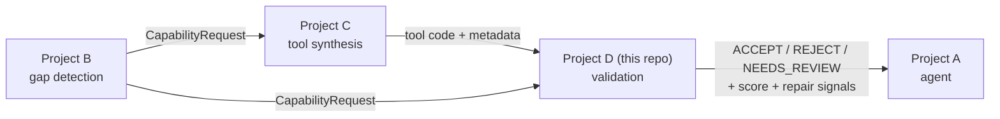
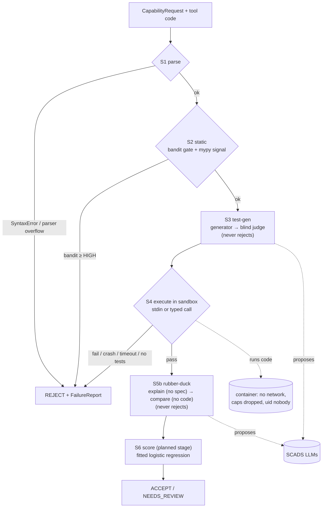

# Project Log — everything so far, in one file

**Project D: a validation layer for LLM-synthesized tools.** Author: Sohaib Ashraf (TU
Dresden). This file is the single place to see **what exists, how it fits together,
what happened when, what was decided, and what the numbers are**. It summarises and
links; the detailed sources are listed in §9.

**Last updated:** 2026-09-26 (Day 10 of the 14-day plan in `PLAN.md`) · branch `main` ·
gate green: **323 tests, 0 skipped** (end of Day 10 work).

> Rule for this file: every number comes from a real run and says where it came from;
> anything estimated says "estimate". Append to §5 (timeline) and §7 (results) as work
> lands; update §1 and §8 when the state changes.

---

## 1. State at a glance

| Research question | What answers it | State (2026-09-26) |
|---|---|---|
| **RQ1** slip rate, naive vs sandboxed | `run_static_vs_dynamic.py` | ✅ **Tier 1 done** (1,999 entries): static slip 100%, execution 0.35% |
| **RQ2** static alone vs dynamic *(headline)* | same runner | ✅ static recall 0.00 in all 11 categories; execution ≥ 0.994 |
| **RQ3** tests from the request, best strategy | `run_testgen_strategies.py` | ✅ eval done (274/300 entries): generated 89.8% vs samples 74.5% |
| **RQ4** reliability score correlates with correctness | `fit_reliability_score.py` | ✅ out-of-fold AUC 0.966, ρ 0.808, Brier 0.058 |
| **RQ5** MCP schema accuracy | S7 + `run_mcp_accuracy.py` | ❌ not started |

| Stage | State |
|---|---|
| S1 parse · S2 static · S3 test-gen · S4 execute (stdin + typed) | ✅ built, tested, S4 verified in real Docker |
| S5b rubber-duck | ✅ built; `compare_explanation@v2` tuned on the dev set |
| S6 score | 🟡 `scoring/signals.py` + `scoring/model.py` built; stage + verdict mapping not yet |
| S5 mutation (arms A, B) · S7 MCP schema | ❌ not built |

**Schedule reality:** PLAN.md wanted all experiments done by Day 10. RQ1–RQ4 have results as
of the end of Day 10; **RQ5 (MCP schema) and S5 mutation are not started.** Commits happened on Days 1, 2, 7, 8, 10 (none on Days 3–6 or 9).

---

## 2. What the system is

Project D sits in a chain: **B** detects a capability gap and emits a *Capability
Request*; **C** synthesizes a tool; **D (this repo)** decides whether the tool is fit to
use; **A** is the agent that uses it.



Input: tool code + a Capability Request in Project B's schema, verbatim (`name`,
`capability`, `description`, typed `inputs`/`outputs`, `rationale`). Output: a verdict, a
reliability score and structured repair signals. It is a **research project**: the
deliverable is experiments + a report, evaluated on **RunBugRun** (Python subset), whose
human-written bugs stand in for synthesized-tool errors (stated as a limitation).

---

## 3. Architecture

### 3.1 Layers and what each may do

```
pipeline.py        decides the verdict          deterministic Python, no LLM
  stages/sN_*.py   one check each               f(artifact, record, sandbox) -> StageResult
    scoring/       signals + fitted model       plain Python + scikit-learn
    prompts/       versioned prompt text        no I/O; docs/PROMPTS.md generated from it
    testgen/       generator + judge wrappers   parse LLM output defensively
      llm/         the only network egress      every call traced; 429s waited out
  sandbox/         the only code execution      Docker, network off, caps dropped
data/loaders/      RunBugRun + CodeNet → requests, tests, examples, labels
experiments/       what you run                 sampling, parallel runs, metrics, results
```

Invariants, each enforced by tests:
1. **The verdict is deterministic.** LLMs only *propose* (tests, explanations). S3 and S5b
   always pass; they record signals, never decide (CLAUDE.md rule 5).
2. **Tool code runs only in the container.** S1/S2 read source on the host; anything that
   executes the tool goes through `sandbox/`.
3. **Infrastructure failures raise; they never become verdicts** (bandit/mypy crash,
   harness error, unusable LLM output, persistent rate limit).
4. **Missing is missing.** A signal that was not produced is `None`, never a guessed 0 or 1.
5. **Only `agents/` may import langgraph** (planned layer, not built), so it is cheap to drop.

### 3.2 How one tool is validated



The pipeline runs stages in order; the **first failed stage short-circuits to REJECT**
and produces a `FailureReport` (the repair signal). Today, all-pass means ACCEPT; the S6
stage will map the score to ACCEPT vs NEEDS_REVIEW (approved 2026-09-26, not built).

### 3.3 Shared types (`contracts.py`, the spine)

| Type | Shape / role |
|---|---|
| `CapabilityRequest` | Project B schema verbatim: `name`, `capability`, `description`, `inputs`/`outputs: list[ParamSpec]`, `rationale` |
| `ParamSpec` | `name`, `type`, `description`, `required` |
| `IOExample` | `input`, `output` (any JSON: stdin text or typed kwargs) — not part of the request |
| `ToolArtifact` | `tool_id`, `code`, `metadata` |
| `StageResult` | `stage`, `passed`, `category`, `detail`, `data` |
| `ValidationRecord` | request + all `StageResult`s + `failures` + `verdict` (mutable accumulator) |
| `FailureReport` | `stage`, `category`, `message`, `line` |
| `Verdict` | `ACCEPT` · `REJECT` · `NEEDS_REVIEW` |
| `Sandbox` (Protocol), `ExecResult`, `Stage` | the execution boundary and the stage signature |

### 3.4 Stages in detail

| Stage | File | What it does | Fails on |
|---|---|---|---|
| S1 parse | `stages/s1_parse.py` | `ast.parse` | syntax error, parser overflow |
| S2 static | `stages/s2_static.py` | bandit (subprocess) + mypy (in-process, own config) | bandit finding ≥ HIGH (configurable); mypy is a signal only |
| S3 test-gen | `stages/s3_testgen.py` | generator proposes *n* tests; judge (other model family, **blind to code**) keeps valid ones — one call per test or one batched call per suite; a prebuilt suite can be recorded for several tools (RQ3 shares one per entry) | never |
| S4 execute | `stages/s4_execute.py`, `harness.py`, `compare.py` | runs **all** tests in one container call; mode from declared inputs (`stdin` → text; typed params → import + call) | wrong output, crash, timeout, `no_tests`, `no_entrypoint` |
| S5b rubber-duck | `stages/s5b_rubberduck.py` | explainer sees code only; comparer (`compare_explanation@v2`) sees request + explanation only, returns met/violated/unknown per requirement; `semantics_score = met/(met+violated)` computed in Python | never |
| S6 score | `scoring/` (stage planned) | see §3.6 | — |

**Output comparison (S4):** trailing whitespace ignored; tokens compared exactly, except
numbers get `math.isclose` (1e-6) **only when the expected token is fractional** — tolerance
everywhere hid 4 real int-vs-float bugs. 10 s per test. Inside the container each test's
output goes to `case.out`/`case.err` (the runner's own reply files are `out`/`err`; sharing
those names corrupted the reply — fixed 2026-09-26).

### 3.5 Sandbox (the safety boundary)

One **fresh container per tool**, force-removed after. Network disabled; memory + swap 512 MB;
128 pids; **all capabilities dropped**; `no-new-privileges`; uid 65534 (nobody); no host
mounts; per-test timeout kills the process group; stdout/stderr capped with
`RLIMIT_FSIZE`. Image `toolvalidator-sandbox:py3.12` = digest-pinned `python:3.12-slim` +
numpy 1.26.4 + mutmut 3.8.0 + pytest 9.1.1. Verified by `docker_probe.py` and real-Docker
tests (no leftover containers).

### 3.6 Reliability score (`scoring/`)

- **`signals.py`** — per tool: `bandit_findings`, `mypy_error_count`, `test_pass_rate`,
  `tests_run`, `semantics_score`, `semantic_violation`, `mutation_score` (None until S5).
  **Leakage guard:** `test_pass_rate` counts only if S3 ran before S4 (generated tests);
  the dataset's own tests are the ground truth and never an input.
- **`model.py`** — logistic regression (standardised), **out-of-fold** predictions with
  folds **grouped by `problem_id`**; reports AUC, Spearman ρ, Brier, calibration bins,
  learned coefficients, and a drop-one-signal ablation. Missing values → `0 + <name>_missing`;
  never-observed signals dropped and listed. Hard gates (S1, S2 bandit) stay outside.

### 3.7 LLM layer

| Role | Model (pinned) | Sees | Limit on this key (measured 2026-09-24) |
|---|---|---|---|
| generator (S3 tests, S5b explain) | `Qwen/Qwen3.8-27B` | request (+ code where allowed) | 120 req · 40,000 tokens / ~60 s |
| judge (S3 judge, S5b compare) | `zai-org/GLM-5.3-Flash` since 09-26 (was `GLM-5.3`: 30 req · 3,000 tokens) | request + candidate, **never code** | 60 req · 10,000 tokens / ~60 s |

- One client (`llm/scads_client.py`), temperature 0, defensive JSON parsing; waits for the
  stated reset on HTTP 429 (bounded, logged). `alias-*` model names are banned.
- **Completion caps** per call: judge 8,192 tokens, generator 16,384 (reasoning counts as
  completion; a Flash comparison once produced 11,860). A reply cut off at the cap raises
  `LLMOutputError` — it is never parsed.
- **Tracing** (`llm/trace.py`): one JSONL row per call — prompt id + version, requested vs
  served model, tokens, latency, ok/error. **Replay** (`llm/replay.py`) answers from a trace
  and raises on a miss.
- **Prompt registry** (`prompts/`): `generate_tests@v1`, `judge_test@v1`, `judge_batch@v1`
  (whole suite in one call), `explain_code@v1`, `compare_explanation@v1` and `@v2` (v2 is the
  S5b default: at most 6 requirements, do not solve the task). Released versions are immutable; `docs/PROMPTS.md` is generated
  and a test fails if it drifts.

### 3.8 Data

- **RunBugRun** Python: 145,370 entries (`train` 133,705 · `valid` 2,054 · `test` 9,611);
  each = buggy + fixed submission + bug-type labels. Programs are stdin/stdout scripts
  (median 10 lines). 321,418 tests; valid split: median 103 tests/problem, max 132.
- **Descriptions** are not in RunBugRun; they come from IBM CodeNet (3,924/3,926 problems).
  Median description 1,063 characters (valid split, 670 problems).
- Mapped onto the request schema as `solve_<problem_id>` with one `stdin`/`stdout` pair;
  statement sample I/O lives on the entry (`examples`), not on the request.
- Experiments use `valid` + `test` (11,665 entries), seeded, ≤ 2 entries per problem.
  Tier 1: 2,000 entries (4,000 tools). Tier 2 (LLM): 300 entries + disjoint 50-entry dev set.

### 3.9 Experiments (what you run)

| Runner | Answers | What it does |
|---|---|---|
| `run_static_vs_dynamic.py` | RQ1, RQ2 | per tool: static-only vs static + execution on the dataset's own tests; `--max-tests` cap (0 = all) |
| `run_testgen_strategies.py` | RQ3 | per entry: one blind 8-test suite, batch-judged; per tool: S4 on `examples` / `generated` / `judged` arms + S5b; `--set dev\|eval`; appends per entry, resumes |
| `fit_reliability_score.py` | RQ4 | fits the score on RQ3 rows (label = variant, group = problem); full fit + named signal sets (all, without S5b, tests only, S5b only, static only) |

Shared plumbing in `common.py`: seeded sampling (≤ 2 per problem), per-entry test cap,
worker count from CPUs and Docker memory, JSONL IO. Tier 2 dev = first 50 of the seeded
order, eval = next 300, so Tier 2 is a subset of Tier 1.

### 3.10 Module inventory (lines · tests)

| Module | Lines | Test file (tests) |
|---|---|---|
| `contracts.py` | 128 | `test_contracts.py` (24) |
| `config.py` | 119 | `test_config.py` (11) |
| `pipeline.py` · `repair.py` · `cli.py` | 53 · 27 · 64 | `test_pipeline.py` (8) · `test_repair.py` (4) · `test_cli.py` (6) |
| `stages/s1_parse.py` · `s2_static.py` | 30 · 138 | 8 · 12 |
| `stages/s3_testgen.py` | 61 | 6 |
| `stages/s4_execute.py` · `harness.py` · `compare.py` | 193 · 210 · 48 | 58 · — · 19 |
| `stages/s5b_rubberduck.py` | 123 | 13 |
| `scoring/signals.py` · `model.py` | 79 · 211 | 6 · 7 |
| `testgen/generator.py` · `judge.py` · `schemas.py` | 45 · 39 · 54 | 8 · 5 · 9 |
| `prompts/` (`spec`, `testgen`, `rubberduck`, `__init__`) | 76 · 127 · 99 · 29 | `test_registry.py` (9) |
| `llm/scads_client.py` · `trace.py` · `replay.py` | 162 · 210 · 72 | 19 · 8 · 8 |
| `sandbox/container.py` · `exec.py` | 42 · 150 | 3 · 16 |
| `data/loaders/runbugrun.py` | 219 | 10 |
| `experiments/common.py` · `run_static_vs_dynamic.py` | 223 · 132 | 18 · 1 |

Table above is as of Day 8. **Day 10 totals: ~3,760 lines of code; 322 tests, 32 marked `slow`** (real Docker, real SCADS, real dataset). Added on Day 10: `experiments/run_testgen_strategies.py` (364), `experiments/fit_reliability_score.py` (60). Over the ~200-line guideline: `run_testgen_strategies.py` (364), `common.py` (223), `harness.py` (212), `model.py` (211), `trace.py` (210) — flagged; splitting the first two needs new files (to be approved).

---

## 4. How work is done here

Test first and watch it fail → implement → full gate
(`ruff format . && ruff check . && mypy --strict toolvalidator data experiments && pytest -q`)
→ one logical change per commit (`<area>: <summary>`), refactors never mixed with features.
Ask before changing `contracts.py`, the pipeline contract, adding a dependency, or a new
top-level module. Details: `WORKFLOW.md`, `CLAUDE.md`.

---

## 5. Timeline

### Day 0 — setup
Scaffold docs (CLAUDE.md, PLAN, STRUCTURE, MEMORY). Locked decisions: fresh codebase;
RunBugRun Python only; all three research components in scope; static checks minimal
(bandit + mypy); score fit from data; LLM never decides a verdict.

### Day 1 — 2026-09-17 · Sprint 1 (the spine) and most of Sprint 2 · 37 commits
- Skeleton, contracts, config, S1, S2, repair, pipeline, `NoExecutionSandbox`, CLI + examples
  → static pipeline end-to-end (71 tests).
- Pre-flight: `docker_probe.py` ALL CHECKS PASSED; SCADS models pinned; RunBugRun inspected
  (stdin/stdout scripts, no descriptions → CodeNet).
- RunBugRun loader; Docker sandbox (container + execution, output caps). Smoke: 10 real
  entries, 0 leftover containers. **Sprint 1 complete, 96 tests, tagged `sprint-1`.**
- Sandbox image with numpy + mutmut; mutmut verified in-container (0 mutants on module-level
  scripts → arm A needs wrapping). Experiment scale decided (tiers, workers).
- SCADS client; S4 execute (batched); experiment plumbing + RQ1/RQ2 runner; **pilot run 1**.
- Float-tolerance + 10 s timeout (run 2); testgen types, generator, judge, S3; S4 consumes
  S3 tests; tolerance restricted to fractional answers (run 3). STATUS report written.

### Day 2 — 2026-09-18 · 4 commits
Run-3 decision recorded; langgraph pinned; **LLM call tracing**; **offline replay**.

### Days 3–6 — no commits.

### Day 7 — 2026-09-23 · alignment · 5 commits
Adopted **Project B's CapabilityRequest verbatim** (examples moved to the dataset entry);
split S4 into stage + `harness.py` + `compare.py`; **typed function-call mode**; versioned
**prompt registry** + generated PROMPTS.md; ARCHITECTURE/LLM/WORKFLOW docs. Docker was down:
22 slow tests skipped, typed mode unverified.

### Day 8 — 2026-09-24 · verification + S5b/S6 · 11 commits
- Real Docker runs found typed mode **broken in-container** (missing `from typing import Any`
  in injected harness source) and stderr previews hiding exception types → fixed. HANDOFF written.
- S5b rubber-duck + its two prompts; S3 calls now traced with prompt ids.
- **SCADS rate limits discovered** (judge 3,000 tokens / ~60 s) → client waits out 429s.
- `scoring/signals.py` (leakage guard caught a real bug in its first version) and
  `scoring/model.py`.
- 25-test cap implemented and **capped pilot** run (§7.2).

### Day 10 — 2026-09-26 · decisions, RQ3 build, dev run, fixes, runs launched
- Decisions approved (below); this log created.
- `judge_batch@v1`: one judge call per suite (1,412 tokens for 8 tests on a real problem).
- S3 can record a prebuilt suite; RQ3 runner (arms `examples`/`generated`/`judged` + S5b)
  and RQ4 runner (`fit_reliability_score.py`) built.
- **Judge switched to GLM-5.3-Flash**: GLM-5.3's 3,000-token window could not serve one
  S5b comparison (a Flash comparison later ran to 11,860 completion tokens). Completion
  caps added (judge 8,192, generator 16,384); truncation raises.
- **Dev run (50 entries, 37 min)** surfaced a real **sandbox harness bug** (per-test files
  clashed with the runner's reply files; fixed with a real-Docker regression test),
  runaway comparisons (→ `compare_explanation@v2`), and missing failed-test indices.
- Launched the **RQ3 eval run (300 entries)** and the **Tier 1 RQ1/RQ2 run (2,000
  entries, all tests)** in parallel. Mid-run, the eval showed 26% of comparisons still
  truncated; a probe of reasoning controls (`reasoning_effort=low`, two "disable thinking"
  switches) was inconclusive (n = 1 each, still 5–7k completion tokens), so the run continued
  and the missing semantic signal is reported, not imputed.
- **Both runs finished.** RQ3 eval: 274/300 entries in 12,270 s (26 lost to LLM failures).
  Tier 1: 1,999 entries in 12,525 s (1 analyzer error). RQ4 fitted on the RQ3 rows; the
  runner gained **named signal sets** after one-at-a-time ablation hid S5b's value
  (its two signals substitute for each other). Results in §7.1b and `STATUS.md` §4.5–4.7.
- Decisions approved by Sohaib this day: batch-judge a suite in one call (GLM-5.3-Flash as
  fallback, then adopted); **RQ3 tests once per entry, blind to code, shared by buggy and
  fixed**; RQ1/RQ2 headline = all tests, cap as sensitivity; S6 may change the verdict mapping.

---

## 6. Decisions (index — full rationale in `DECISIONS.md`)

| Date | Decision |
|---|---|
| Day 0 | Fresh start; RunBugRun Python only; all 3 components in scope; minimal static checks; score fit from data |
| 09-17 | Python 3.12 `.venv`; only `toolvalidator` installable; gate type-checks `data/` + `experiments/` |
| 09-17 | Mutation arm A (mutmut) runs **inside** the sandbox |
| 09-17 | Contract shapes; `Sandbox` is a Protocol in contracts; config invents no defaults |
| 09-17 | S1: parser overflow fails, empty code passes · S2: bandit rejects at HIGH, mypy is a signal |
| 09-17 | Pipeline semantics before S6: first failure → REJECT, all pass → ACCEPT |
| 09-17 | Models: generator Qwen3.8-27B, judge GLM-5.3 (other family, blind to code) |
| 09-17 | Descriptions from CodeNet; loader behaviour; sandbox execution design |
| 09-17 | Real-infrastructure tests skip visibly, never pass vacuously |
| 09-17 | Sandbox image with numpy; mutmut yields no mutants on module-level scripts |
| 09-17 | Experiment scale: seeded tiers, ≤ 2 per problem, fresh container per tool, W workers |
| 09-17/18 | Output comparison: whitespace-insensitive, tolerance only for fractional answers |
| 09-23 | CapabilityRequest = Project B schema verbatim · S4 typed mode · prompt registry |
| 09-24 | S5b: blind explainer + blind comparer, score in Python, always passes |
| 09-24 | 25-test cap = seeded sample per entry (buggy and fixed see the same tests) |
| 09-24 | S6 inputs from generated tests only (leakage guard); missing → indicator |
| 09-26 | Batch judging; per-entry blind test generation; all-tests headline; S6 verdict mapping approved |
| 09-26 | Judge → `GLM-5.3-Flash` (GLM-5.3 window could not serve one call); completion caps; truncation raises; S5b failure keeps the entry with semantics missing |
| 09-26 | After the dev run: harness file-name fix, generator cap 16,384, failed-test indices per arm, `compare_explanation@v2` as default |
| 09-26 | RQ4 reports named signal sets (joint ablation), not only drop-one ablation |

---

## 7. Results so far (all real runs)

### 7.1 RQ1/RQ2 pilot — 200 entries (400 tools), seed 20260917, 10 workers, 0 errors

| Configuration | Slip (buggy accepted) | False rejection (fixed rejected) | unusable_fixed | s/tool |
|---|---|---|---|---|
| Static only (S1 + S2) | **200/200 = 100%** | 0/200 | — | ~0.5 (static part) |
| + execution, run 1 (exact text, 5 s) | 1/200 = 0.5% | 9/200 = 4.5% | 9 | 2.16 |
| + execution, run 2 (tolerance everywhere, 10 s) | 5/200 = 2.5% | 4/200 = 2.0% | 4 | 2.16 |
| **+ execution, run 3 (tolerance for fractional only) — headline** | **1/200 = 0.5%** | **4/200 = 2.0%** | 4 | 2.16 |
| run 3 + **25-test cap** (sensitivity) | **19/200 = 9.5%** | 3/200 = 1.5% | 3 | 1.33 |

- **Static analysis caught 0 bugs in all 11 bug categories.** Execution (run 3) recall 1.00
  everywhere except `call` 0.99.
- The one uncapped slip (entry 451069) passes all 103 of its own tests: dataset label noise.
- **The cap matters:** all 18 extra slips fail only 1–3 of ~103 tests uncapped (rare-input
  bugs); capped recall falls to 0.78–0.90 in most categories. 87% of problems have > 25 tests.
- Results: `results/pilot`, `pilot2`, `pilot3`, `pilot3_cap25` (git-ignored).

### 7.1b Final runs (Day 10) — full tables in `reports/STATUS.md` §4.5–4.7
- **Tier 1 RQ1/RQ2** (1,999 entries, all tests): static slip 100%, false rejection 0%;
  static + execution slip **0.35%** (7), false rejection **1.5%** (30 = all `unusable_fixed`).
- **RQ3** (274/300 eval entries, one blind 8-test suite per entry): bugs caught — statement
  samples 74.5%, generated 89.8%, judged 88.7%; correct tools rejected 2.2% / 8.0% / 5.5%.
  S5b flagged 87.7% of buggy vs 1.6% of fixed tools where it gave a verdict, and 12 of 18
  bugs the tests missed; its signal is missing for 16.6% of tools (more for buggy).
- **RQ4** (548 tools, out of fold, grouped by problem): AUC **0.966**, ρ **0.808**, Brier
  **0.058**; without S5b 0.927; tests only 0.931; static only 0.573.

### 7.2 Measured costs
**Real runs (Day 10):** RQ3 eval ~5,350 generator + ~6,180 judge tokens per completed entry,
12,270 s for 300 entries at 4 workers; Tier 1 3.13 s/tool at 6 workers — both while sharing
the machine, so inflated. Dev-run medians per call: generate 2,346 tokens / 14.5 s, batched
judge 1,584 / 9.2 s, explain 895 / 5.7 s, compare 2,066 / 23.0 s.
**Earlier:** static ~0.5 s/tool; one sandbox call ~0.3 s; 50 tests batched in one call 1.32 s (vs ~300 ms
per test unbatched). LLM, n = 1 each on a toy task: S3 judge 278 tokens / 3.7 s; S5b
compare 1,015 tokens / 45.5 s; S5b explain 486 tokens / 2.5 s. SCADS latency varies ~10x
between identical calls.

### 7.3 S5b first real run (2 toy tools, not a result)
Correct `max` program: 4 met, 0 violated (score 1.0). `min`-for-`max` bug: 3 met, 1 violated
(score 0.75), with the right evidence quoted.

---

## 8. Open items and known issues

1. **Next:** RQ5 (S7 MCP schema) — the only RQ with no result; then S5 mutation (arm A needs a
   script→function wrapping step); then the S6 stage (needs a saved fitted model; the clean
   split wants a new `scoring/metrics.py`, not yet approved).
2. **RQ3 caveats to carry into the report:** 26/300 entries lost to LLM failures (likely
   the harder problems); S5b signal missing for 16.6% of tools, more for buggy (62) than
   fixed (29), so part of S5b's RQ4 gain may be that missingness; generated suites copy the
   statement samples (arm overlap); the Flash judge's strength vs the generator is unverified.
3. **Judge budget and runaway reasoning** remain the binding LLM constraints (§3.7).
4. Five files over the size guideline (§3.10).
5. 3 correct programs are too slow for a 10 s per-test limit; 1 expected output looks
   malformed upstream (entry 26394).
6. Planned `agents/` (LangGraph) layer not built; cut first if the schedule bites.

---

## 9. Where the details are

| Need | File |
|---|---|
| Standing rules | `CLAUDE.md` |
| Start of a session | `docs/HANDOFF.md` |
| Durable context + session log | `docs/MEMORY.md` |
| Research plan + schedule | `docs/PLAN.md`, `docs/reports/SPRINTS.md` |
| Why each decision | `docs/DECISIONS.md` |
| Architecture (diagrams) | `docs/ARCHITECTURE.md` |
| LLM setup, limits, cost | `docs/LLM.md` · prompt text: `docs/PROMPTS.md` |
| Results + methodology | `docs/reports/STATUS.md` · per-task logs: `sprint-01.md`, `sprint-02.md` |
| Folder layout | `docs/STRUCTURE.md` · upstream schema: `docs/capability_request.md` |
