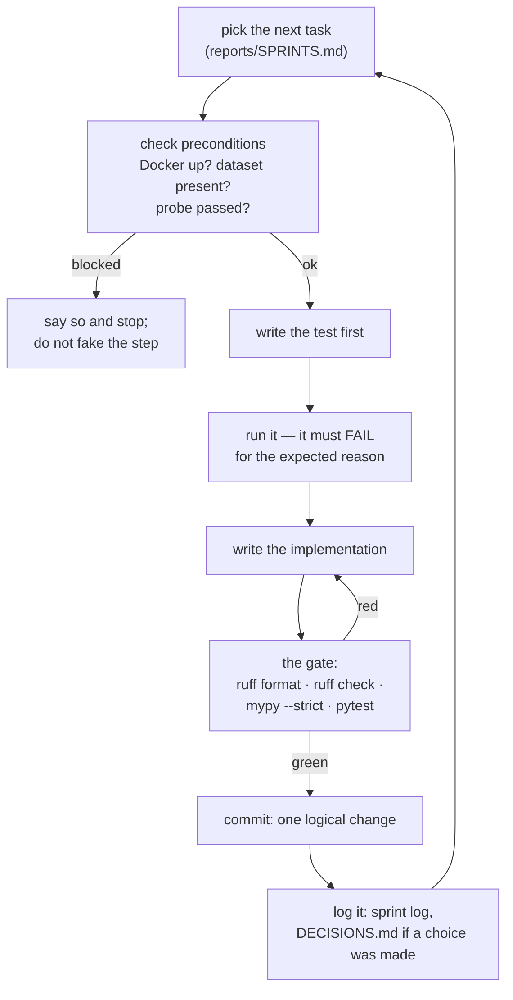
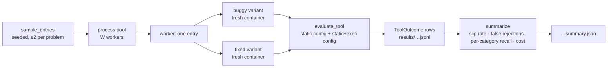

# Workflow

Two workflows: how code gets written here, and how an experiment is run. The pipeline's
own flow is in [ARCHITECTURE.md](ARCHITECTURE.md) §4.

---

## 1. Development loop



**The gate**, run before every commit:

```bash
ruff format . && ruff check . && mypy --strict toolvalidator data experiments && pytest -q
```

Rules that have already paid for themselves:

- **Test first, and watch it fail.** A test that passes before the code exists is testing
  nothing. Seeing the failure message is the check.
- **The gate gates the commit.** Once, a commit went in while the gate was red
  (`8b3b520`, fixed in `25fdae4`); the failure had been masking mypy silently not
  checking `data/`, which was in turn hiding a real typing bug.
- **Refactor and feature never share a commit.** Splitting `s4_execute` and adding the
  typed mode were `d983994` and `5a8c73c`.
- **Ask before the spine moves.** Changing `CapabilityRequest`, adding a dependency, or
  creating a new top-level module is a question, not a decision.
- **Infrastructure failures raise; they never become verdicts.** A bandit crash, a
  sandbox failure, or an LLM outage must not be able to look like a bad tool.
- **Measure, don't guess.** Every number in the docs came from a run; estimates say so.

## 2. Test layers

| Layer | What it uses | Runs when |
|---|---|---|
| unit | fakes (`FakeSandbox`, scripted LLM clients) | always, fast |
| real analyzer | the actual bandit and mypy | always (~0.5 s each) |
| real dataset | the downloaded RunBugRun files | when present, else skipped with a reason |
| real Docker | the sandbox image and daemon | when the daemon is up, else skipped with a reason |
| real SCADS | one call per role | when a key and model ids are configured |

257 tests, 27 of them `slow` (real infrastructure). A skip always prints *why*, so a
skipped sandbox test can never be mistaken for a passing one.

## 3. Experiment run



Properties that keep results trustworthy:

- **Seeded sampling**, capped per problem, so a popular problem cannot dominate and a run
  can be repeated exactly.
- **A fresh container per tool.** Every tool runs as the same unprivileged user, so a
  shared container would let one tool leave files or processes that affect the next.
- **Worker errors are recorded, not swallowed.** The summary carries `n_errors` and the
  first twenty messages.
- **Label noise is reported.** `unusable_fixed` counts correct programs that fail their
  own dataset tests in our sandbox — an upper bound on how much the dataset itself is
  wrong.
- **One command, config in the output.** Seed, splits, worker count, sandbox image and
  per-tool cost all land in the summary next to the numbers.

```bash
python -m experiments.run_static_vs_dynamic --n 200 --out results/pilot
```

## 4. Session ritual

At the start: read `docs/MEMORY.md` and `docs/PLAN.md`, say which task is being picked
up. At the end: update the sprint log, add a `DECISIONS.md` entry for any choice made,
leave a one-line note in the MEMORY session log, and commit. A sprint that meets its exit
criteria gets a `sprint: complete Sprint N` commit and a `sprint-N` tag.
